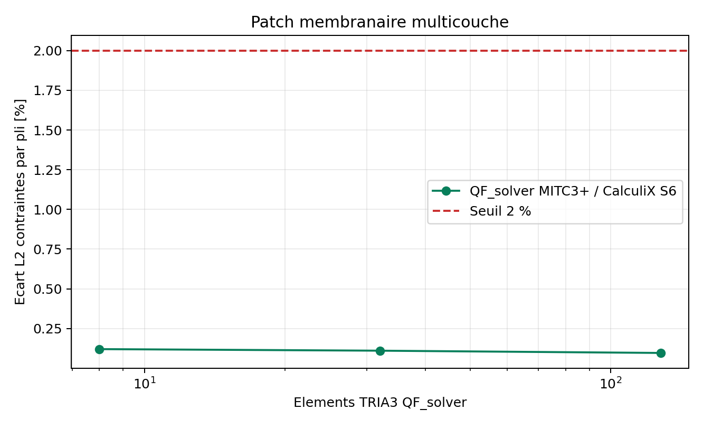

# V&V MITC3+ multicouche statique et dynamique

## Resultat de la campagne

`VNV-MITC3-LAMINATE-DYNAMIC-001` reunit une verification analytique du patch
membranaire, puis modal, Newmark et harmonique sur un porte-a-faux MITC3+
`8 x 2` en `[0/90/90/0]`. La campagne est interne et reproductible : elle
verifie la coherence de `K`, `M`, de la reduction du drilling et des trois
routes dynamiques. Elle ne remplace pas une correlation structurelle
independante.

Les resultats calcules sont conserves dans
`qualification/vnv/mitc3_laminate_dynamic/reference/summary.json`.

| Controle | Valeur observee | Limite | Verdict |
| --- | ---: | ---: | --- |
| Patch membranaire affine, maillage fin | `8.48e-13` | `1e-10` | PASS |
| Plis post-traites en statique | `4` | `4` | PASS |
| Residus propres relatifs | `2.40e-09` | `1e-07` | PASS |
| Orthogonalite masse | `5.24e-16` | `1e-07` | PASS |
| Orthogonalite raideur | `9.91e-12` | `1e-07` | PASS |
| DDL drilling condenses | `24` | `> 0` | PASS |
| Erreur Newmark T/80 | `2.62e-03` | `1e-02` | PASS |
| Derive energie Newmark | `1.65e-12` | `1e-04` | PASS |
| Erreur harmonique complexe | `1.84e-08` | `1e-06` | PASS |
| Limite statique harmonique | `< 1e-09` | `1e-09` | PASS |
| Post-traitement harmonique | `4` plis | `4` plis | PASS |

## Raffinement temporel independant

La campagne `VNV-MITC3-LAMINATE-TEMPORAL-REFINEMENT-001` reprend exactement
le meme modele et compare Newmark a la solution analytique du premier mode,
avec `80`, `160` et `320` pas par periode. Elle isole donc l'erreur de
discretisation temporelle sans confondre celle-ci avec la difference entre
MITC3+ et l'element DST de Code_Aster.

| Pas par periode | Pas de temps (s) | Erreur RMS | Ordre observe |
| ---: | ---: | ---: | ---: |
| `80` | `8.970e-4` | `0.2623 %` | - |
| `160` | `4.485e-4` | `0.0656 %` | `1.999` |
| `320` | `2.243e-4` | `0.0164 %` | `2.000` |

La preuve temporelle est **PASS_INTERNAL** : la derive energetique reste sous
`2.3e-12`, le residu dynamique sous `2.3e-12`, et l'erreur fine est sous `1 %`.
Elle ne ferme pas le gate externe, car les ecarts Code_Aster/DST persistent
avec une autre matrice `K/M` et une frequence propre differente.

Les artefacts sont disponibles dans
`qualification/vnv/mitc3_laminate_temporal_refinement_2026-08-21/`, avec le
rapport, la figure log-log, le JSON et le manifeste.

### Audit independant de la masse

Une quadrature Duffy de Gauss-Legendre d'ordre 12 recalcule la masse developpee
et la masse condensee du triangle. La difference relative est de `1,1783e-7`
avant condensation et `1,1803e-5` apres condensation. Le bilan de masse
translationnelle est a `1,8623e-15`, la masse reste semi-definie positive et le
bloc de drilling nodal est nul. Cette preuve exclut une erreur dominante de
quadrature de masse, mais ne remplace pas une comparaison avec un element
externe de meme ordre.

Le dossier est archive dans
`qualification/vnv/mitc3_mass_quadrature_audit_2026-08-21/`.

## Correlation externe de reponse

`VNV-MITC3-LAMINATE-DYNAMICS-CODEASTER-DST-019` compare le porte-a-faux
multicouche sur le meme maillage `12 x 3` TRIA3 a Code_Aster 18.1 DST. Les
ecarts maximaux observes sont `3,957 %` sur les quatre frequences, `2,318 %`
sur l'historique Newmark et `1,345 %` sur la reponse harmonique complexe,
tous sous les seuils traces. Les artefacts sont archives dans
`qualification/vnv/external/code_aster_mitc3_laminate_dynamic/reference/`.

Cette correlation porte sur des observables de reponse globale. Une campagne
CalculiX distincte couvre les contraintes planes par pli; elle ne transforme
pas les observables dynamiques globaux en preuve de contraintes dynamiques.

### Raffinement strict a 1 %

La campagne `VNV-MITC3-LAMINATE-DYNAMICS-REFINEMENT-CODEASTER-DST-020` ajoute
les maillages `8x2`, `12x3`, `16x4` et `24x6`. Au dernier niveau, les erreurs
QF_solver/Code_Aster sont de `1,778 %` en modal, `5,558 %` en Newmark et
`3,275 %` en harmonique. Les residus restent acceptables (`1,082e-08` modal
et `6,849e-11` dynamique), mais les trois observables depassent la limite
engineering de `1 %`. Le calcul externe est donc execute et trace, tandis que
le gate de promotion `stable` reste **BLOQUE**. La tendance n'autorise pas une
extrapolation vers les stratifies courbes, amortis ou endommages.

Les preuves sont dans
`qualification/vnv/external/code_aster_mitc3_laminate_dynamic_refinement_strict/reference/`.
La commande reproductible est :

```powershell
python .\scripts\run_code_aster_mitc3_laminate_dynamic_refinement_vnv.py `
  --output .\results\VNV-MITC3-LAMINATE-DYNAMICS-REFINEMENT-CODEASTER-DST-020 `
  --levels 8x2 12x3 16x4 24x6
```

### Diagnostic externe du pas de temps

Sur le maillage spatial fixe `12x3`, Code_Aster a ete relance avec `80`, `160`
et `320` pas par periode. Les ecarts restent pratiquement constants :

| Pas/periode | Modal | Newmark RMS | Harmonique |
| ---: | ---: | ---: | ---: |
| `80` | `3,9573 %` | `2,3231 %` | `1,3410 %` |
| `160` | `3,9573 %` | `2,3243 %` | `1,3410 %` |
| `320` | `3,9573 %` | `2,3247 %` | `1,3410 %` |

Le diagnostic confirme que le pas de temps n'est pas la cause principale de
l'ecart externe. Le gate `stable` reste bloque par la difference de formulation
et de matrices `K/M` entre MITC3+ et DST. Les artefacts sont archives dans
`qualification/vnv/external/code_aster_mitc3_laminate_dynamic_temporal_refinement_2026-08-21/reference/`.

### Reference DKT du sous-perimetre mince

Une campagne Code_Aster `DKT`, plus proche de la limite Kirchhoff-Love d'une
coque mince, a ete executee sur `12x3`, `16x4` et `24x6`. Au dernier niveau,
les ecarts sont `0,3940 %` en modal, `0,1968 %` en Newmark et `0,0880 %` en
harmonique. Ce resultat ouvre un sous-perimetre stable candidat, mais ne vaut
pas pour les stratifies epais, courbes, amortis ou non symetriques. Une Owner
Review dediee est necessaire avant promotion.

Le dossier est disponible dans
`qualification/vnv/external/code_aster_mitc3_laminate_dynamic_refinement_dkt_2026-08-21/reference/`.

## Correlation externe des contraintes par pli

`VNV-MITC3-LAMINATE-PLY-STRESS-CALCULIX-S6-020` compare le patch membranaire
affine `[0/90/90/0]` a CalculiX 2.20 `S6 COMPOSITE`, aux points d'integration
et dans les axes materiau. Sur le maillage final `16 x 4` (128 triangles),
l'ecart L2 combine de `S11`, `S22`, `S12` des quatre plis est `0,09625 %`,
sous le seuil de `2 %`. Le dernier increment CalculiX est `0,07313 %`, sous
le seuil de stabilisation de `0,2 %`; l'erreur analytique du patch QF_solver
est `2,278e-13`.



La comparaison exclut volontairement les bords libres, `S13`, `S23`, la
flexion, les contraintes interlaminaires et toute extrapolation nodale. Les
artefacts sont archives dans
`qualification/vnv/external/calculix_mitc3_laminate_ply_stress/reference/`.

## Decision de maturite

Les couples `MITC3 / laminate_linear_static` et `MITC3 / laminate_dynamic`
passent de `smoke_tested` a `verified_development_external_correlation`. Ils
restent hors scope Owner accepte tant que ne sont pas disponibles :

1. au moins un stratifie courbe/facettise avec axe materiau projete ;
2. une Owner review dediee fixant domaine d'emploi et tolerances.

Les chiffres, images et manifestes sont generes par le solveur. Aucun resultat
numerique n'est recopie manuellement dans cette page.
