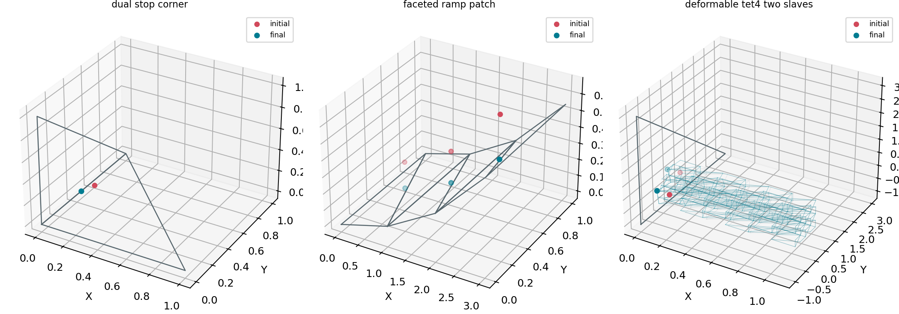
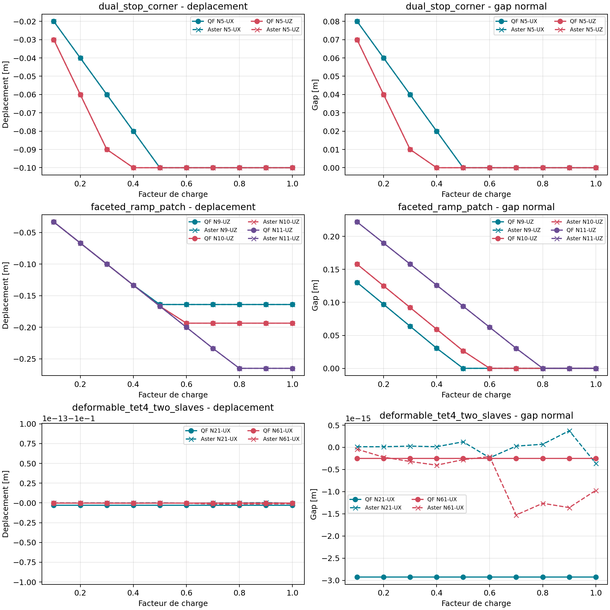
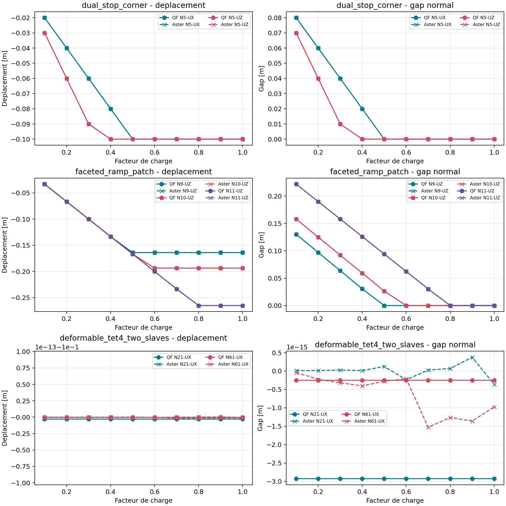

# Owner review - Contact V1

## Decision enregistree

Perimetre : contact unilateral sans frottement en `linear_static`, petites
transformations, active-set noeud-triangle avec une surface maitre bornee.
La decision est une acceptation engineering interne bornee, jamais une
certification ni une acceptation du grand glissement.

| Champ | Valeur proposee |
| --- | --- |
| Scope | `contact-v1-linear-static-bounded` |
| Classe d'usage | `engineering_ready_bounded` |
| Type de revue | `owner_review` |
| Decision | `accepted_for_bounded_engineering_use` |
| Revendication de certification | aucune |

## Preuves a examiner

| Etude | Observable | Verdict |
| --- | --- | --- |
| `VNV-CONTACT-FRICTION-BLOCK-001` | Kuhn-Tucker, ouverture, fermeture et loi locale | PASS interne |
| `VNV-CONTACT-TET4-STRUCTURAL-001` | convergence reaction normale TET4 | PASS interne |
| `VNV-CONTACT-DEFORMABLE-MASTER-003` | transfert barycentrique vers maitres elastiques | PASS interne |
| `VNV-CONTACT-TET4-MASTER-FACE-004` | face frontiere TET4 deformable | PASS interne |
| `VNV-CONTACT-MASTER-SURFACE-005` | facette, normale actualisee et patch esclave | PASS interne |
| `VNV-CONTACT-CODEASTER-LIAISON-UNIL-001` | ouverture/fermeture normale externe | PASS externe |
| `VNV-CONTACT-CODEASTER-TET4-MASTER-004` | cinematique active sur face TET4 | PASS externe, facette imposee |
| `VNV-CONTACT-CODEASTER-FOLDED-NORMAL-006` | normale finale inclinee | PASS externe, facette imposee |
| `VNV-CONTACT-CODEASTER-FOLDED-SEARCH-007` | recherche autonome sur pli | PASS externe, ecart moyen `0,1157 %` |
| `VNV-CONTACT-ADDITIONAL-MODELS-008` | coin double, rampe facettisee et bloc TET4 a deux esclaves | PASS interne |
| `VNV-CONTACT-CODEASTER-ADDITIONAL-009` | dix niveaux de charge, bloc raffine a `768` TET4 | PASS externe, ecart `4,3400 %` |
| `VNV-CONTACT-CODEASTER-ADDITIONAL-H10K-010` | confirmation sur `9 984` TET4 | PASS externe, courbes confondues |

## Preuves complementaires demandees par l'Owner review

La premiere decision Owner review etait `more_evidence_required`. Les trois modeles
demandes sont maintenant executes :

| Modele | Particularite | Resultat |
| --- | --- | --- |
| `dual_stop_corner` | deux normales actives simultanement | gaps nuls, reactions `100/200 N` |
| `faceted_ramp_patch` | trois esclaves sur trois zones d'une rampe facettisee | trois contacts actifs, gaps nuls |
| `deformable_tet4_two_slaves` | bloc de `576` TET4 avec deux points de contact | gaps `< 7e-16 m`, reactions positives |



Le statut technique enregistre apres relecture devient
`engineering_ready_bounded`. Il ne signifie pas que le contact general est
pret : surface-surface, grand glissement et frottement general restent hors
scope.

## Correlation externe des trois nouveaux modeles

Les courbes QF_solver et Code_Aster utilisent dix facteurs de charge identiques.
Le coin double et la rampe facettisee sont confondus a la precision numerique :
les erreurs maximales de courbe sont inferieures a `5,3e-14 %`.

Le bloc a d'abord ete calcule avec `576` TET4, puis raffine a `768` TET4 a la
demande du proprietaire :

- QF_solver et Code_Aster sont confondus sur la branche fermee a partir du
  facteur `0,2`;
- QF_solver et CalculiX coincident avant contact avec un ecart maximal de
  `2,10e-5 %` sur le maillage raffine;
- Code_Aster ferme le second esclave des le facteur `0,1`, tandis que
  QF_solver et CalculiX le conservent encore ouvert;
- l'ecart maximal QF_solver/Code_Aster descend de `5,2565 %` a `4,3400 %`,
  sous le seuil Owner review de `5 %`.



Le verdict automatique final est `PASS_EXTERNAL_CORRELATION`. La difference de
branche au premier palier reste visible comme observation de sensibilite au
maillage, mais elle satisfait le seuil d'acceptation explicite.

## Confirmation proche de 10 000 elements

Une confirmation supplementaire a ete executee avec une grille structuree
`26 x 8 x 8`, soit exactement `9 984` TET4 et `2 190` noeuds avec les trois
noeuds maitres. Les deux contacts sont deja fermes au premier facteur de
charge; la comparaison porte donc sur toute la courbe QF_solver/Code_Aster.

| Mesure | Valeur | Critere | Verdict |
| --- | ---: | ---: | --- |
| Ecart relatif maximal deplacement | `3,3029e-12 %` | `< 5 %` | PASS |
| Ecart absolu maximal de jeu actif | `3,3029e-15 m` | `< 1e-8 m` | PASS |
| Jeu final maximal | `9,7145e-16 m` | `< 1e-8 m` | PASS |
| Elements | `9 984` TET4 | confirmation demandee | PASS |



Cette confirmation montre que l'ecart de `4,3400 %` observe sur `768` TET4
etait lie a la discretisation de la transition de contact. Elle ne constitue
pas une qualification du contact general, mais ferme la condition quantitative
fixee par l'Owner review pour le domaine borne.

## Limites a accepter explicitement

- Pas de grand glissement, de topologie variable ni de recherche generale
  surface-surface dans QF_solver.
- Le mode `updated` est sans frottement et limite a des iterations de petites
  translations.
- La correlation autonome compare un patch discret QF_solver a une surface
  esclave DKT Code_Aster; elle est comportementale, pas paire-a-paire.
- Le bloc TET4 presente un decalage d'activation Code_Aster sur les maillages
  grossiers; ce decalage disparait sur la confirmation a `9 984` TET4.
- Le contact avec frottement reste un scope distinct, experimental; seule la
  branche de glissement sature est correlee externement.

## Decision Owner review

- [x] Les rapports, PNG et manifestes V&V sont lisibles.
- [x] Les trois modeles complementaires sont acceptes.
- [x] Les fermetures, reactions et geometries sont acceptees.
- [x] Le statut `engineering_ready_bounded` est accepte.
- [x] L'ecart raffine `4,3400 %` est inferieur au seuil `5 %`.
- [x] La confirmation `9 984` TET4 donne un ecart de `3,3029e-12 %`.
- [x] Decision : `accepted_for_bounded_engineering_use`.

## Reponses du proprietaire

Vous pouvez transmettre vos reponses sous cette forme :

```text
CONTACT-V1 FINAL
Q1 OUI
Q2 OUI
Q3 OUI
Q4 accepted_for_bounded_engineering_use
Condition : ecart raffine inferieur a 5 %, satisfait a 4,3400 %.
Confirmation : 9984 TET4, ecart QF_solver/Code_Aster 3,3029e-12 %.
```

La decision `accepted_for_bounded_engineering_use` est enregistree. Elle
n'inclut ni
frottement general, ni grand glissement, ni contact surface-surface general.

PDF Owner review :
[Owner review Contact V1](../assets/reviews/owner_review_contact_v1.pdf).

## Commandes de controle

```powershell
python .\qf_solver.py verify-contact --output .\results\VNV-CONTACT-V1-001
python .\scripts\run_code_aster_contact_folded_search_vnv.py `
  --output .\results\VNV-CONTACT-CODEASTER-FOLDED-SEARCH-007
python .\scripts\run_code_aster_contact_additional_vnv.py `
  --output .\results\VNV-CONTACT-CODEASTER-ADDITIONAL-009
python .\scripts\run_code_aster_contact_additional_vnv.py `
  --output .\results\VNV-CONTACT-CODEASTER-ADDITIONAL-H10K-010 `
  --digest .\qualification\external_reference_digests\contact_code_aster_additional_h10k.json `
  --tet4-grid 26 8 8 `
  --study-id VNV-CONTACT-CODEASTER-ADDITIONAL-H10K-010
python -m pytest tests\unit\test_frictionless_contact.py `
  tests\verification\test_contact_master_surface_vnv.py
python .\scripts\build_docs.py --profile engineering
```
