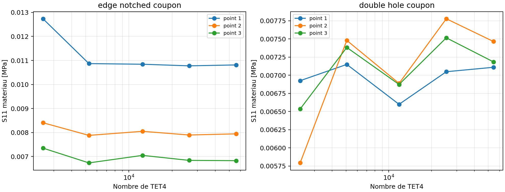
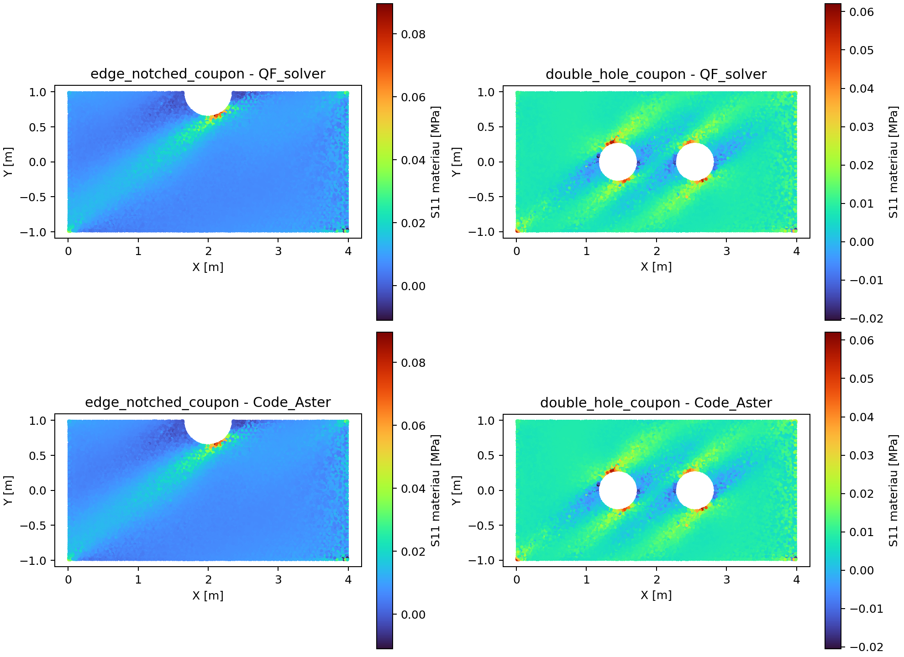

# Owner review - Contraintes orthotropes proches des singularites

## Decision enregistree

Perimetre : evaluation de `S11` dans les axes materiau sur TET4 orthotropes,
par chemins a distances physiques fixes et moyennes de bande. La decision ne
porte jamais sur le pic ponctuel d'un angle rentrant.

| Champ | Valeur proposee |
| --- | --- |
| Scope | `orthotropic-solid-singular-stress-assessment` |
| Classe d'usage | `engineering_internal_bounded` |
| Statut technique | `engineering_internal_validated_with_recommendations` |
| Decision | `accepted_with_recommendations` |
| Certification | aucune |

## Preuves a examiner

La campagne `VNV-ORTHOTROPIC-SINGULAR-STRESS-005` utilise huit maillages pour
deux geometries, QF_solver, Code_Aster 18.1.0 et CalculiX 2.20.

| Cas | Maillage fin | Increment chemin | Increment bande | Code_Aster |
| --- | ---: | ---: | ---: | ---: |
| trou de rayon fini | `86 469` TET4 | `1,342 %` | `0,125 %` | `< 6,0e-11 %` |
| angle rentrant | `237 358` TET4 | `1,625 %` | `3,420 %` | `< 5,4e-9 %` |

Tous les criteres bloquants sont sous le seuil de `5 %`. La bande nodale
CalculiX de l'angle rentrant differe de `6,357 %` et reste un `WARNING`
diagnostique : CalculiX extrapole aux noeuds tandis que QF_solver effectue une
recuperation compacte ponderee par volume. L'ecart de chemin fin est `0,306 %`.

## Limites a accepter explicitement

- Le pic ponctuel au coin rentrant est informatif seulement.
- La decision porte sur les chemins et bandes converges, pas sur une contrainte
  nodale maximale.
- `S11` n'est pas un critere de rupture anisotrope.
- Endommagement, delaminage et contraintes par pli restent hors scope.
- La revue est une auto-revue engineering interne, sans certification.

## Reponses du validateur

Decision finale enregistree le 29 juillet 2026 :

- Q1 : OUI
- Q2 : OUI
- Q3 : OUI
- Q4 : OUI
- Q5 : `accepted_with_recommendations`

Le bloc ci-dessous est conserve comme trace du questionnaire soumis :

```text
CONTRAINTES-SINGULIERES
Q1 les cas eprouvette entaillée et double trou sont acceptes : OUI / NON
Q2 les increments finaux chemin/bande, tous inferieurs a 5 %, sont acceptes : OUI / NON
Q3 les cartes S11 QF_solver/Code_Aster sont coherentes : OUI / NON
Q4 la politique de lecture hors pics singuliers reste acceptee : OUI / NON
Q5 decision finale : accepted_with_recommendations / rejected / more_evidence_required
Commentaires :
```

La recommandation technique est `accepted_with_recommendations`, avec maintien
visible du `WARNING` CalculiX et interdiction d'utiliser le pic singulier comme
valeur de dimensionnement.

## Preuves complementaires demandees le 29 juillet 2026

La premiere decision Owner review etait `more_evidence_required`. Deux nouvelles
pieces ont ete raffinees sur cinq niveaux et comparees a Code_Aster :

| Cas | TET4 fin | Increment chemin | Increment bande | Code_Aster |
| --- | ---: | ---: | ---: | ---: |
| eprouvette a encoche arrondie | `55 935` | `0,611 %` | `0,868 %` | `< 1,7e-11 %` |
| eprouvette a deux trous | `54 342` | `4,404 %` | `0,556 %` | `< 1,2e-10 %` |





Les deux cas satisfont le seuil de `5 %`. Les cartes affichent explicitement
`S11` dans les axes materiau pour QF_solver et Code_Aster.

PDF Owner review :
[Owner review des contraintes singulieres](../assets/reviews/owner_review_contraintes_singulieres.pdf).

## Fichiers de preuve

- `qualification/external_reference_digests/orthotropic_singular_stress_h8.json`
- `qualification/external_reference_digests/orthotropic_additional_stress.json`
- `qualification/reviews/orthotropic_singular_stress_pending.json`
- `qualification/reviews/orthotropic_singular_stress_2026-07-29.json`
- `docs/verification/contraintes_singularites.md`
- `results/VNV-ORTHOTROPIC-SINGULAR-STRESS-005-REFINED-H8-LARGE/report.md`
