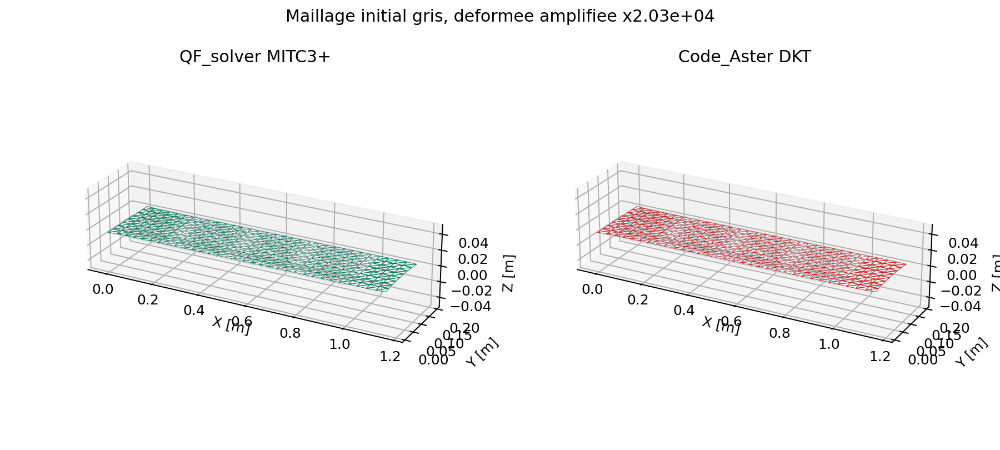
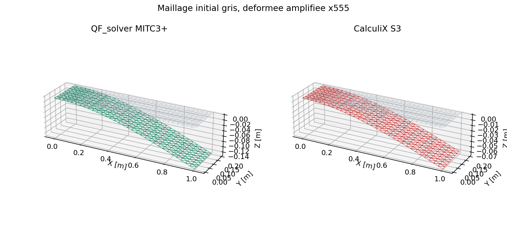
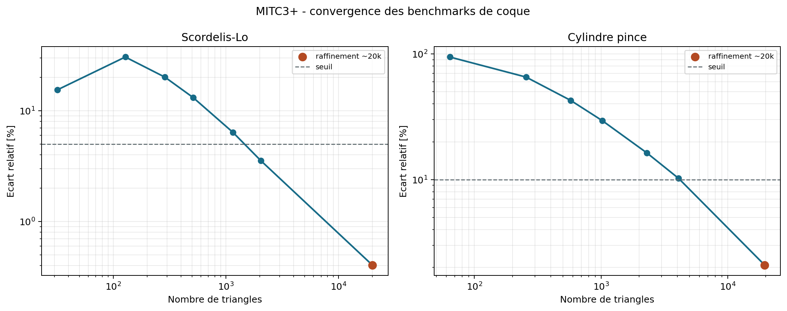
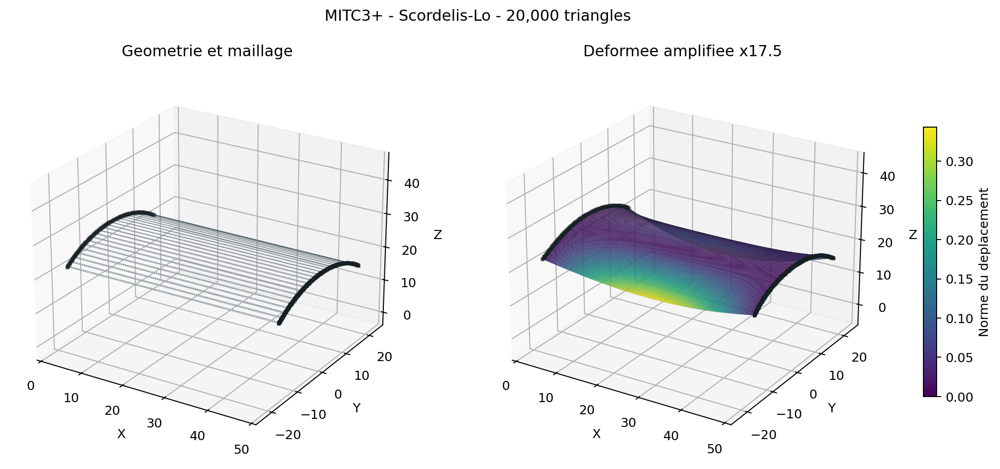
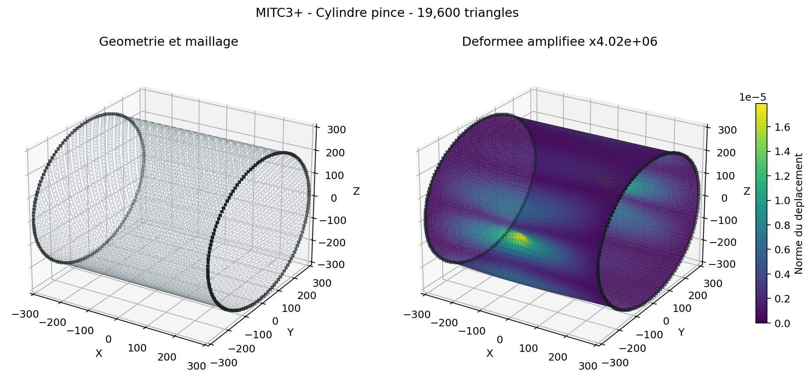
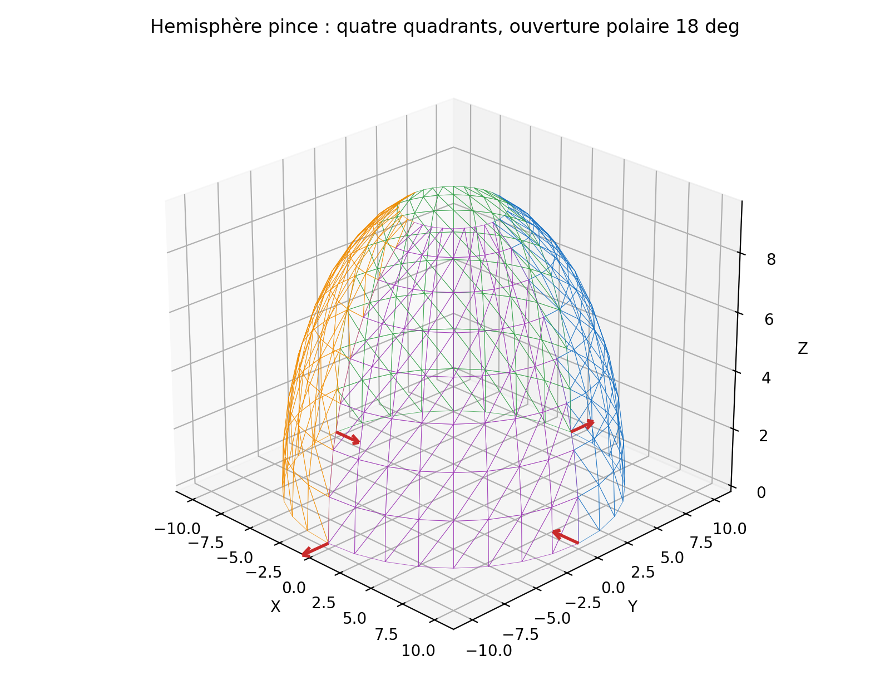
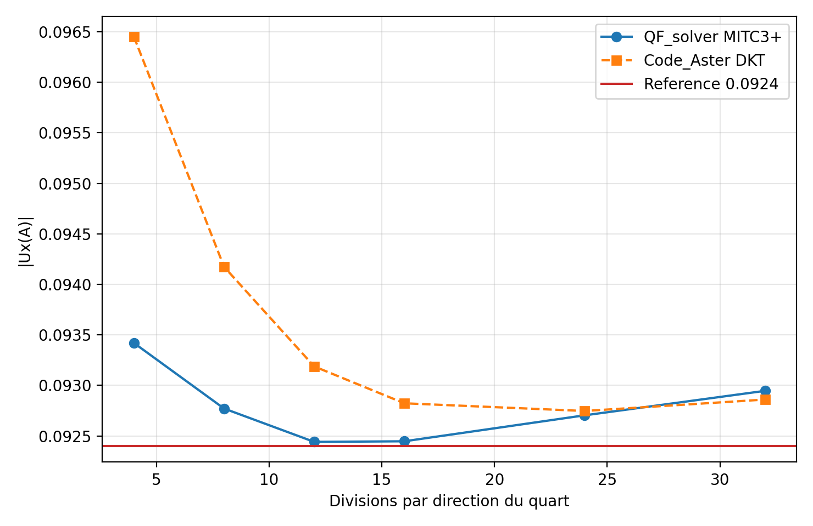
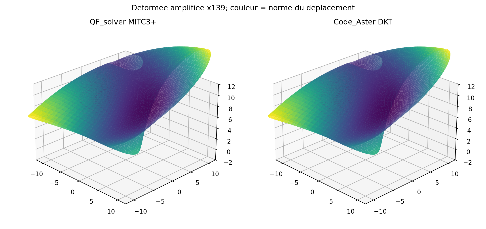
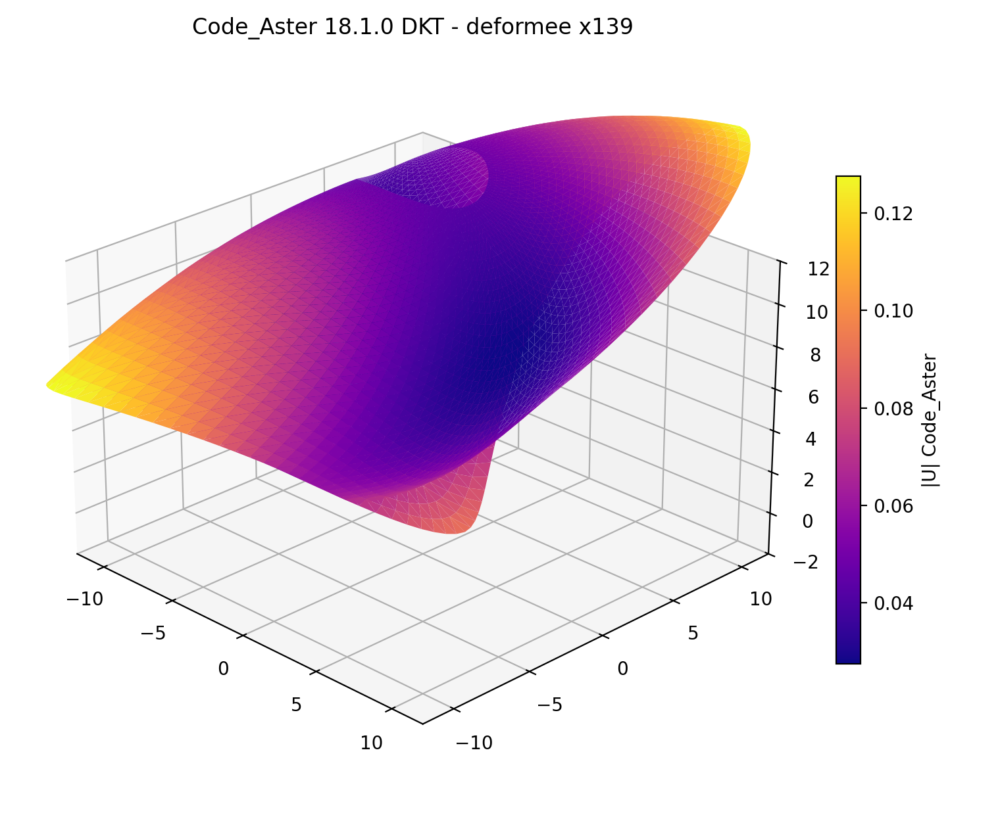

# Owner review MITC3+ statique lineaire

## Etat soumis

Le MITC3+ est implemente et utilisable par JSON, API, CLI et import Gmsh. La
campagne raffinee conclut `PASS`. Quentin Farinazzo a ferme la revue le
1er aout 2026. Le registre autoritatif est
`qualification/reviews/mitc3_linear_static_2026-08-01.json`.

## Resultats a examiner

| Preuve | Resultat | Interpretation proposee |
| --- | ---: | --- |
| patch affine | PASS | erreur membrane 2,23e-16 |
| cisaillement transverse constant | PASS | erreur d'interpolation 1,81e-16 |
| interface MITC3/MITC4 | PASS | compatibilite de bord |
| distorsion 0 a 30 % | PASS rapide | ecart de reponse borne |
| plaque mince | PASS | ratio fin 0,97951 sur 2 048 triangles |
| Cook | PASS | erreur finale 0,6435 % |
| Scordelis-Lo | PASS | 3,5392 % a 2 048 puis 0,4044 % a 20 000 triangles |
| cylindre pince | PASS | 10,2320 % a 4 096 puis 2,0899 % a 19 600 triangles |
| Code_Aster DKT membrane | 5,96e-8 | excellent accord |
| Code_Aster DKT flexion | 0,007116 % | excellent accord sur formulation differente |
| patch flexion explicite | PASS | `kappa_x`, `kappa_y`, `kappa_xy` a 2e-13 |
| hemisphere pince / reference | 0,5912 % | coque doublement courbe, six maillages |
| hemisphere pince / Code_Aster | 0,0927 % | sonde fine; champ complet 0,1536 % |
| CalculiX S3 membrane | 0,0086 % | accord |
| CalculiX S3 flexion | 113,086 % | temoin negatif, pas oracle |

## Figures

Documents PDF directement utilisables pour la revue:

- [Revue statique MITC3+](../assets/reviews/owner_review_mitc3_statique.pdf)
- [Annexe Scordelis-Lo H20K](../assets/reviews/vnv_mitc3_scordelis_h20k.pdf)
- [Annexe cylindre pince H20K](../assets/reviews/vnv_mitc3_cylindre_pince_h20k.pdf)
- [Annexe hemisphere pince et Code_Aster](../assets/reviews/vnv_mitc3_hemisphere_code_aster.pdf)

## Reponses de l'Owner

1. Q1 : **OUI**. La condition demandee, ajouter l'hemisphere pince a quatre
   quadrants avec convergence, est satisfaite.
2. Q2 : **OUI**.
3. Q3 : **OUI** pour la correlation Code_Aster.
4. Q4 : **OUI**. La condition de verification sur l'hemisphere pince est
   satisfaite; CalculiX S3 reste uniquement un temoin negatif.
5. Q5 : **OUI**. Les affichages Code_Aster demandes sont inclus ci-dessus et
   dans le PDF.
6. Q6 : **OUI**, usage engineering borne accepte.

## Decision

**ACCEPTED_FOR_BOUNDED_ENGINEERING_USE**, le 1er aout 2026 par Quentin
Farinazzo, en Owner review non independante et sans revendication de
certification externe. Cette decision couvre uniquement la statique lineaire
MITC3+ dans le domaine documente; modal, Newmark et harmonique conservent des
scopes distincts en developpement.
