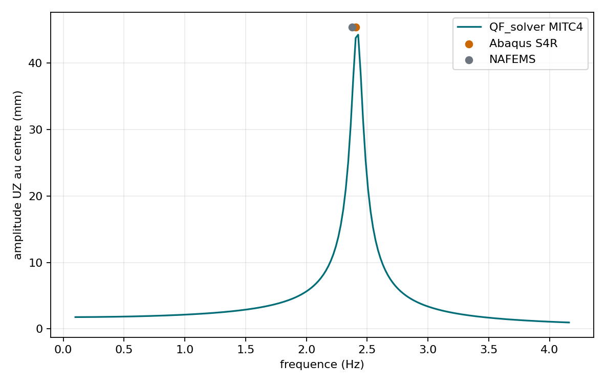
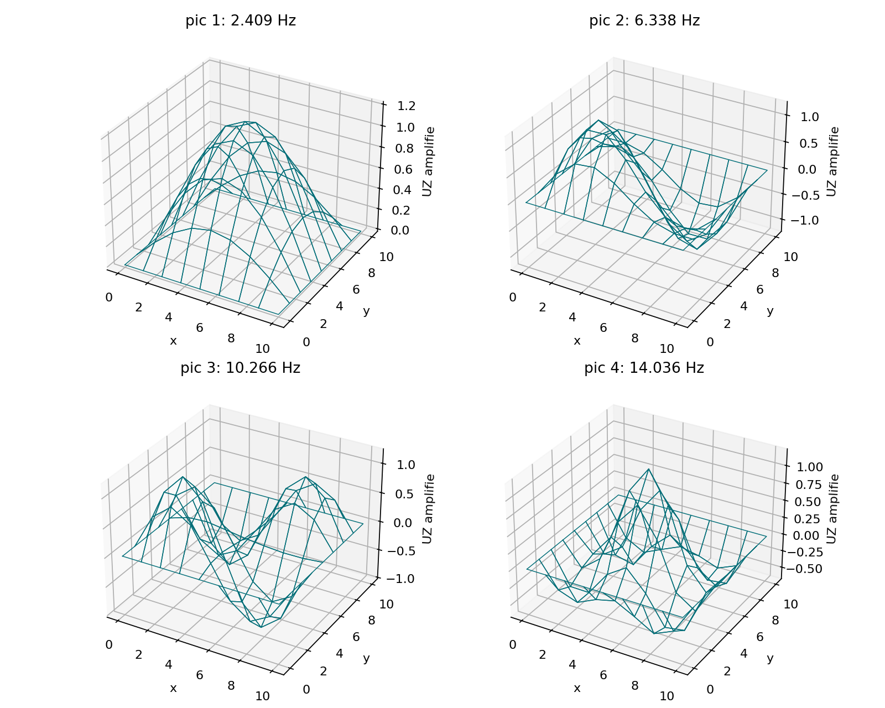
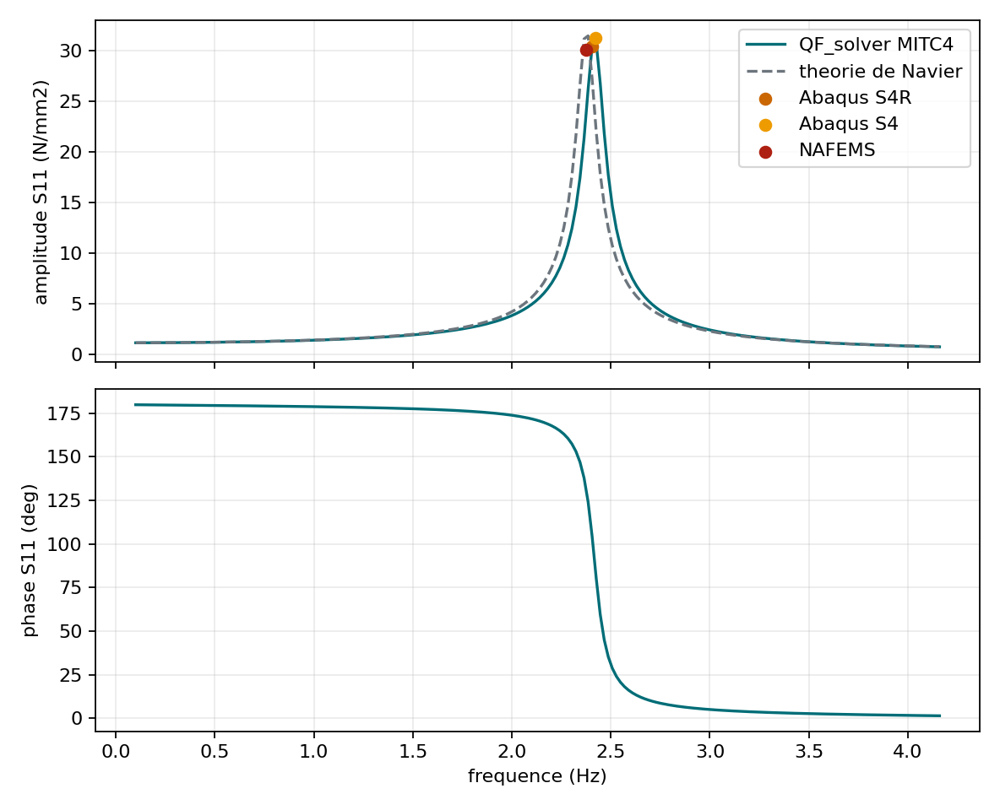
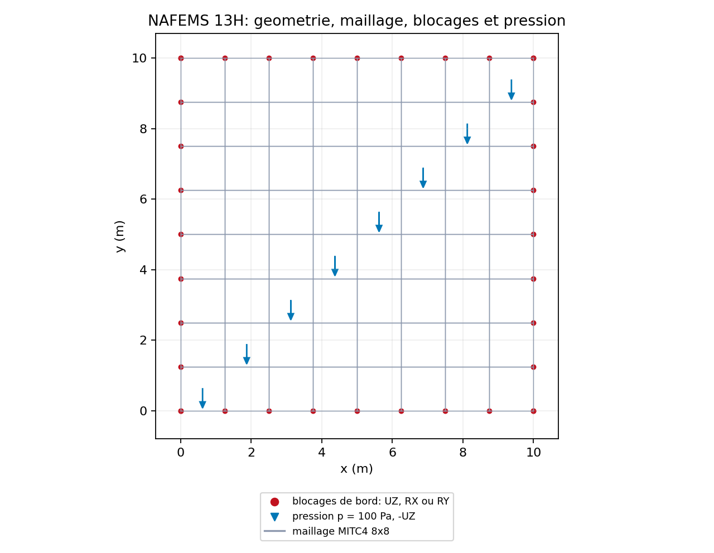
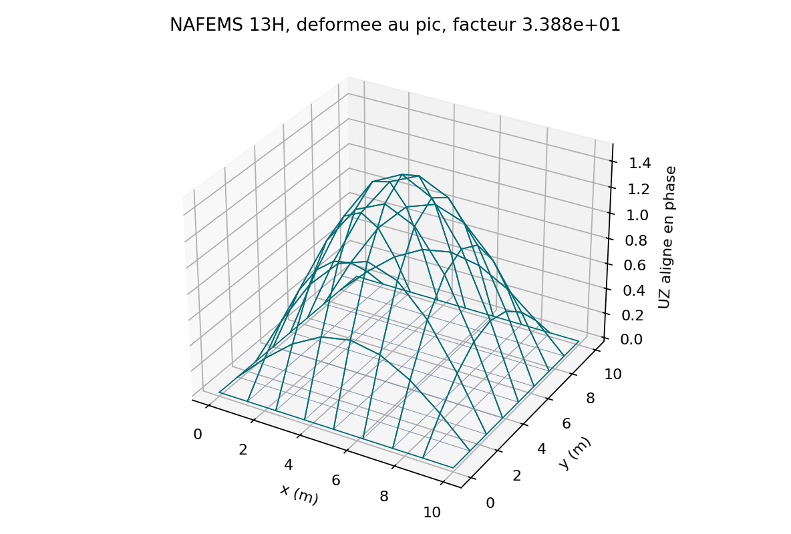

# Revue mecanique MITC4 harmonique

## Decision courante

Le scope `mitc4-harmonic-response` est accepte avec recommandations pour un
usage engineering interne. Cette auto-revue ne revendique aucune certification
et n'est pas independante.

| Champ | Valeur |
| --- | --- |
| Validateur | Quentin Farinazzo |
| Mode | `self_review` |
| Independence | `not_independent` |
| Statut technique | `validated_with_recommendations` |
| Decision | `accepted_with_recommendations` |
| Date | `2026-07-15` |

Le registre faisant foi est
`qualification/reviews/mitc4_harmonic_response_2026-07-15.json`.

## Preuves a examiner

### Reponse monomodale

`VNV-MITC4-HARMONIC-MODAL-001` verifie la limite statique, la reponse
complexe fermee, la resonance, la phase et la sensibilite a l'amortissement.

### Condensation du drilling

`VNV-MITC4-HARMONIC-CONDENSATION-002` compare le complement de Schur au
systeme complexe complet avec amortissement de Rayleigh et chargement direct
de la rotation de drilling.

### Excitation large bande

`VNV-MITC4-HARMONIC-BROADBAND-003` balaie `0,1-16 Hz` sous une force
decentree. Les `175` modes massiquement orthonormes constituent une base
complete du systeme reduit. Quatre familles de resonance sont identifiees.

| Indicateur | Valeur | Limite | Verdict technique |
| --- | ---: | ---: | --- |
| erreur complexe plein champ | `2,411e-7` | `1e-6` | PASS |
| erreur de frequence maximale | `0,729 %` | `1 %` | PASS |
| residu relatif maximal | `8,251e-11` | `1e-8` | PASS |
| familles de resonance | `4` | `>= 4` | PASS |

### Correlation externe NAFEMS 13H

`VNV-MITC4-HARMONIC-NAFEMS13H-004` reproduit le maillage `8x8`, les
conditions aux limites, la pression, l'amortissement et le balayage publies
par Abaqus/Standard pour le Test 13H NAFEMS.

| Indicateur | QF_solver | Abaqus S4R | Ecart | Limite |
| --- | ---: | ---: | ---: | ---: |
| pic de deplacement | `44,2719 mm` | `45,38 mm` | `2,442 %` | `5 %` |
| pic `S11` face | `30,8186 MPa` | `30,37 MPa` | `1,477 %` | `5 %` |
| frequence du pic | `2,42583 Hz` | `2,405 Hz` | `0,866 %` | `3 %` |
| residu relatif maximal | `3,881e-10` | - | - | `1e-8` |

Source primaire: [Abaqus/Standard, NAFEMS Test 13H](https://docs.software.vt.edu/abaqusv2024/English/SIMACAEBMKRefMap/simabmk-c-forcedvibrationtest13h.htm).

## Processus de correlation externe retenu

L'absence d'une licence Abaqus locale n'est pas bloquante. La validation
harmonique applique desormais la triangulation suivante :

```text
QF_solver <-> theorie analytique <-> NAFEMS publie <-> CalculiX/Code_Aster
```

Les quatre niveaux n'ont pas le meme role :

| Niveau | Role dans la preuve | Etat actuel |
| --- | --- | --- |
| QF_solver | resultat a verifier, residus, amplitude, phase et contraintes complexes | disponible |
| theorie de Navier | oracle analytique independant pour la plaque mince | disponible |
| NAFEMS 13H et tables Abaqus publiees | benchmark industriel publie et valeurs scalaires de reference | disponible |
| CalculiX | calcul externe reproductible avec logiciel libre | execute, `WARNING` documente |
| Code_Aster | seconde implementation externe, DKQ Kirchhoff sur QUAD4 | execute, `PASS` |

La correlation libre devra reprendre la geometrie, les proprietes, le maillage
`8x8`, la pression, les appuis, la loi d'amortissement et les `200` frequences
du cas 13H. Si une famille d'element strictement equivalente n'existe pas, la
formulation retenue et ses differences avec MITC4, S4 et S4R seront declarees.

Pour chaque solveur externe, le dossier de preuve contiendra au minimum :

- le fichier d'entree natif et sa somme SHA-256 ;
- le nom et la version exacte du solveur ;
- le journal de calcul et son statut de convergence ;
- les conventions de repere, de face, de signe et de contrainte ;
- les courbes complexes `UZ` et `S11` par frequence ;
- amplitude et phase au centre, frequence de pic et residu disponible ;
- une deformee PNG au pic et un resultat de champ exploitable ;
- un tableau d'ecarts avec QF_solver, Navier et NAFEMS.

Les criteres provisoires sont `5 %` sur les pics de deplacement et de
contrainte, `3 %` sur la frequence du pic, et une verification qualitative de
la phase avant, au voisinage et apres resonance. Un ecart superieur ne sera
pas masque : il declenchera une analyse des formulations, de l'integration, de
l'amortissement et de la recuperation des contraintes.

### Premiere correlation CalculiX

CalculiX `2.20-1` a ete execute dans une image Debian 12 verrouillee. Le S4
lineaire est ecarte comme comparateur principal: sa frequence de `3,675 Hz`
et sa fleche de `16,890 mm` revelent une raideur excessive pour cette plaque
mince. CalculiX expanse en effet ses coques en elements tridimensionnels.

La sensibilite S8R sur les memes `8x8` cellules fournit :

| Grandeur | CalculiX S8R | QF_solver | Navier | NAFEMS |
| --- | ---: | ---: | ---: | ---: |
| frequence du pic | `2,376974 Hz` | `2,425829 Hz` | `2,376723 Hz` | `2,377 Hz` |
| deplacement central | `45,4050 mm` | `44,2719 mm` | `45,4128 mm` | `45,42 mm` |
| `S11` face superieure | `31,5820 MPa` | `30,8186 MPa` | `32,0127 MPa` | `30,03 MPa` |

Les ecarts S8R/QF_solver sont respectivement `2,014 %`, `2,559 %` et
`2,477 %`. L'ecart de contrainte S8R/NAFEMS vaut `5,168 %`, legerement au-dessus
du seuil de `5 %`; le verdict CalculiX reste donc `WARNING`. La contrainte est
extrapolee de facon trilineaire des huit points de Gauss de la coque expansee
vers `z=+1`, puis moyennee en complexe sur les quatre elements centraux.

{ .result-figure }

La comparaison scalaire CalculiX S8R reste tracee dans le tableau ci-dessus et
dans la baseline harmonique. La figure publiee ici est la courbe QF_solver et
ses references, car le fichier brut CalculiX n'est pas une entree de la
construction documentaire courante.

### Correlation Code_Aster

Code_Aster `18.1.0` a ete execute localement dans une image Docker epinglee.
La modelisation `DKT` appliquee aux `64` QUAD4 produit l'element quadrilateral
`DKQ`. Ce choix Kirchhoff n'est pas identique au MITC4 Reissner-Mindlin, mais
il constitue une comparaison independante pertinente pour cette plaque mince.

| Grandeur | Code_Aster DKQ | QF_solver | Ecart DKQ/QF | NAFEMS | Ecart DKQ/NAFEMS |
| --- | ---: | ---: | ---: | ---: | ---: |
| frequence du pic | `2,344221 Hz` | `2,425829 Hz` | `3,364 %` | `2,377 Hz` | `1,379 %` |
| deplacement central | `45,1132 mm` | `44,2719 mm` | `1,900 %` | `45,39 mm` | `0,610 %` |
| `S11` face superieure | `29,8103 MPa` | `30,8186 MPa` | `3,272 %` | `30,03 MPa` | `0,732 %` |

Les trois ecarts Code_Aster/QF_solver sont inferieurs au seuil de `5 %`.
`S11` est reconstruit de facon independante a partir des rotations nodales
complexes Code_Aster, avec courbure bilineaire au centre des quatre elements
centraux. Cette reconstruction est testee et auditable, mais une extraction
native des contraintes Code_Aster reste une recommandation de consolidation.

La figure comparative Code_Aster de cette revue historique n'est pas
reproductible dans le profil documentaire engineering courant ; les valeurs
et la methode de reconstruction restent decrites et auditees dans l'archive
de preuve correspondante.

## Figures de revue

{ .result-figure }

{ .result-figure }

{ .result-figure }

{ .result-figure }

{ .result-figure }

{ .result-figure }

## Checklist du validateur

- [x] Examiner la geometrie, le maillage, les blocages et le chargement.
- [x] Examiner les amplitudes et les changements de phase aux resonances.
- [x] Verifier l'accord direct/superposition modale sur toute la bande.
- [x] Examiner la provenance et les ecarts NAFEMS/Abaqus.
- [x] Enregistrer la decision, la date et les recommandations.
- [ ] Revoir mecaniquement la nouvelle courbe `S11` par frequence.
- [x] Executer CalculiX S4/S8R sur le cas 13H et comparer les courbes complexes completes.
- [x] Executer Code_Aster DKQ sur le cas 13H et comparer les courbes complexes completes.
- [x] Conserver Abaqus S4/S4R comme reference publiee sans exiger une licence locale.
- [ ] Obtenir une revue independante avant toute revendication de qualification.

## Commandes reproductibles

```powershell
python .\scripts\run_mitc4_harmonic_broadband_vnv.py --output .\results\VNV-MITC4-HARMONIC-BROADBAND-003
python .\scripts\run_mitc4_nafems13h_vnv.py --output .\results\VNV-MITC4-HARMONIC-NAFEMS13H-004
python .\scripts\run_calculix_nafems13h_vnv.py --dat .\results\VNV-MITC4-HARMONIC-CALCULIX13H-S8R-006\nafems13h_calculix_s8r.dat --formulation S8R --output .\results\VNV-MITC4-HARMONIC-CALCULIX13H-S8R-006
python .\scripts\run_code_aster_nafems13h_vnv.py --output .\results\VNV-MITC4-HARMONIC-CODEASTER13H-DKQ-007
python .\qf_solver.py qualification-readiness --scope mitc4-harmonic-response
```

La derniere commande doit retourner le code `0` pour le scope `candidate`.
