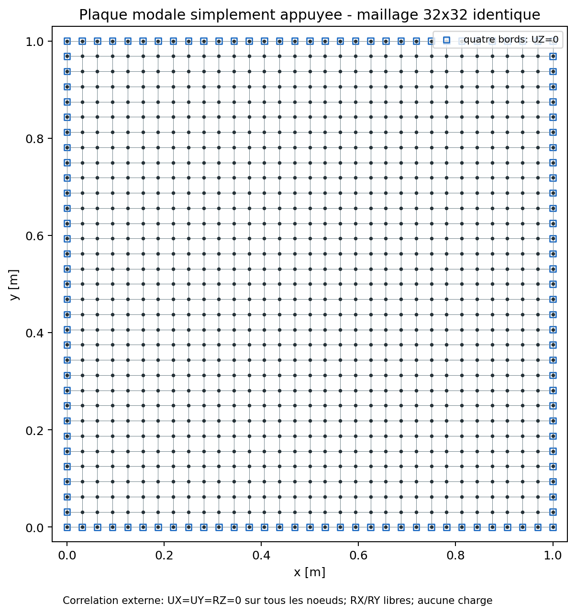

# Revue mecanique MITC4 modale

## Objet de la revue

Ce document porte l'Owner review du scope `mitc4-modal` de QF_solver. Il
regroupe les preuves sur la masse coherente, la condensation du drilling, les
frequences propres, les formes modales, les residus, les orthogonalites et la
correlation externe Code_Aster.

La readiness automatique est **PASS** et le scope reste `candidate`. Quentin
Farinazzo enregistre le 16 juillet 2026 une tentative de validation interne,
avec la decision `accepted_with_recommendations` et l'usage borne
`engineering_internal_provisional`.

| Champ | Valeur enregistree |
| --- | --- |
| Validateur | Quentin Farinazzo |
| Mode | `self_review` |
| Independence | `not_independent` |
| Scope | `mitc4-modal` |
| Readiness | `PASS`, `12/12` exigences et `11/11` formules |
| Statut | `candidate`, pret pour revue |
| Decision Owner | `accepted_with_recommendations`, provisoire |
| Certification revendiquee | aucune |

## Perimetre candidat

Le domaine propose couvre:

- coques MITC4 isotropes homogenes, epaisseur constante par element;
- petits deplacements et petites rotations;
- masse coherente avec inerties translationnelles et rotations tangentielles;
- formulation de masse exclusivement coherente (`mass_formulation=consistent`);
- absence d'inertie artificielle sur la rotation de drilling;
- condensation des directions de drilling libres effectivement sans masse;
- modes propres d'une structure lineaire contrainte;
- frequences, formes, normalisation masse, residus, orthogonalites et masses
  modales effectives;
- solveur dense `eigh` pour les campagnes de reference et solveur creux
  `eigsh` pour les modeles compatibles.

Restent hors du perimetre accepte: grandes rotations, precontrainte,
flambement, modes complexes, amortissement non proportionnel, couplage
fluide-structure, composites, offsets et masse ajoutee non structurelle.

## Probleme propre et normalisation

Apres application des blocages et condensation des ddl sans masse:

```text
K_r phi_i = lambda_i M_r phi_i
f_i = sqrt(lambda_i) / (2 pi)
```

`K_r` et `M_r` sont les matrices reduites, `phi_i` est le mode propre,
`lambda_i` sa valeur propre et `f_i` la frequence en hertz.

Les modes sont massiquement normalises:

```text
phi_i^T M_r phi_j = delta_ij
phi_i^T K_r phi_j = lambda_i delta_ij
```

`delta_ij` est le symbole de Kronecker: il vaut `1` si `i=j`, sinon `0`.

Le residu relatif controle pour chaque paire propre est:

```text
numerateur   = norme_2(K_r phi_i - lambda_i M_r phi_i)
denominateur = max(norme_2(K_r phi_i),
                   abs(lambda_i) norme_2(M_r phi_i),
                   1)
r_i          = numerateur / denominateur
```

Une frequence propre est une caracteristique du modele lineaire; elle ne
constitue ni une amplitude de reponse forcee ni une preuve suffisante de
justesse physique.

## Masse coherente et drilling

La masse MITC4 integre:

```text
M_e = integrale sur A de [N^T D_m N] dA

D_m = diag(rho t, rho t, rho t,
           rho t^3 / 12, rho t^3 / 12, 0)
```

`rho` est la masse volumique, `t` l'epaisseur, `A` la surface moyenne et `N`
la matrice d'interpolation. Le dernier zero correspond a l'absence d'inertie
artificielle sur la rotation locale de drilling `RZ`.

La direction locale `RZ` ne recoit aucune masse fictive. Lorsqu'elle est libre
et sans masse, elle est eliminee par complement de Schur avant le calcul modal,
puis reconstruite. Les tests verifient masse totale, inerties, symetrie,
positivite, objectivite et absence de modes parasites de drilling.

Dans la correlation Code_Aster de plaque plane, `UX`, `UY` et `RZ` sont
bloques sur tous les noeuds dans les deux solveurs. Ce choix impose exactement
le meme sous-espace de flexion DKQ/MITC4; la condensation libre du drilling est
verifiee separement par les campagnes internes.

## Mesures de forme modale

Le Modal Assurance Criterion est:

```text
MAC(phi, psi) = abs(phi^T psi)^2
                / [(phi^T phi) (psi^T psi)]
```

Le signe et l'amplitude d'un mode sont arbitraires. Pour une valeur propre
double, chaque solveur peut retourner une combinaison differente des deux
vecteurs. Les modes `(1,2)/(2,1)` sont donc compares par les valeurs singulieres
des deux bases orthonormales; la plus petite valeur au carre mesure l'accord du
sous-espace complet.

## Etude 1 - Porte-a-faux Euler-Bernoulli

`VNV-MITC4-MODAL-CANTILEVER-002` utilise une plaque mince de longueur `1 m`,
largeur `0,2 m` et epaisseur `0,01 m`, encastree a une extremite. La reference
du premier mode est:

```text
f_1 = [beta_1^2 / (2 pi L^2)] sqrt(E I / (rho A))
beta_1 = 1,8751040687
```

`L` est la longueur, `E I` la rigidite de flexion et `rho A` la masse
lineique.

| Indicateur final, maillage `24x6` | Valeur | Critere | Verdict |
| --- | ---: | ---: | --- |
| frequence analytique | `8,225218 Hz` | reference | - |
| frequence MITC4 | `8,333017 Hz` | - | - |
| erreur relative | `1,311 %` | `<= 5 %` | PASS |
| MAC de forme | `0,9999834` | `>= 0,995` | PASS |
| residu relatif | `3,50e-8` | `<= 1e-7` | PASS |
| orthogonalite masse | `3,94e-16` | `<= 1e-7` | PASS |

Cette preuve est bornee au premier mode de flexion d'un solide elance.

## Etude 2 - Plaque simplement appuyee de Navier

Pour une plaque carree mince:

```text
D      = E t^3 / [12 (1 - nu^2)]
f_mn   = [pi / (2 a^2)] sqrt(D / (rho t)) (m^2 + n^2)
```

`a` est le cote de la plaque, `D` sa rigidite de flexion, et `m`, `n` les
indices modaux de Navier.

La campagne `VNV-MITC4-MODAL-PLATE-003` emploie cinq maillages de `4x4` a
`16x16`. Le point fin fournit:

| Mode | Navier [Hz] | MITC4 [Hz] | Erreur | MAC |
| --- | ---: | ---: | ---: | ---: |
| `(1,1)` | `48,406724` | `48,560500` | `0,318 %` | `0,999999982` |
| `(1,2)/(2,1)` | `121,016810` | `122,752200` | `1,434 %` | sous-espace `0,999999923` |
| `(2,2)` | `193,626896` | `196,555564` | `1,513 %` | `0,999999833` |

Le residu relatif maximal de la campagne vaut `2,27e-9` au point fin et
l'erreur d'orthogonalite masse `9,31e-16`.

## Etude 3 - Correlation Code_Aster DKQ

La correlation `VNV-MITC4-MODAL-CODEASTER-DKQ-004` utilise un maillage
identique `32x32`, soit `1024` elements et `1089` noeuds. Le materiau est
`E=70 GPa`, `nu=0,3`, `rho=2700 kg/m3`, `t=0,01 m`.

Les conditions physiques de flexion sont identiques:

- `UZ=0` sur les quatre bords;
- `UX=UY=RZ=0` sur tous les noeuds pour isoler le sous-espace transverse;
- rotations tangentielles libres;
- aucune charge, car il s'agit d'un probleme propre.



| Mode | Navier [Hz] | QF_solver [Hz] | Code_Aster [Hz] | Ecart QF/Aster |
| --- | ---: | ---: | ---: | ---: |
| `(1,1)` | `48,406724` | `48,370391` | `48,371263` | `0,002 %` |
| `(1,2)` | `121,016810` | `121,264781` | `120,875437` | `0,322 %` |
| `(2,1)` | `121,016810` | `121,264781` | `120,875437` | `0,322 %` |
| `(2,2)` | `193,626896` | `193,893856` | `193,062528` | `0,431 %` |
| `(1,3)` | `242,033620` | `243,810927` | `241,717151` | `0,866 %` |
| `(3,1)` | `242,033620` | `243,811738` | `241,717151` | `0,867 %` |
| `(2,3)` | `314,643706` | `316,115359` | `313,378614` | `0,873 %` |
| `(3,2)` | `314,643706` | `316,115359` | `313,378614` | `0,873 %` |
| `(1,4)` | `411,457153` | `417,510143` | `410,900114` | `1,609 %` |
| `(4,1)` | `411,457153` | `417,510143` | `410,900114` | `1,609 %` |

Une premiere execution `16x16` avait revele `7,26 %` d'erreur QF_solver face
a Navier sur les modes `(1,4)/(4,1)`. Elle a donc ete conservee comme point de
convergence et non acceptee comme resultat final. Le raffinement `32x32`
ramene l'erreur QF_solver/Navier maximale a `1,471 %` et l'ecart
QF_solver/Code_Aster maximal a `1,609 %`, sous le seuil de `3 %`.

| Accord de forme QF_solver / Code_Aster | MAC | Critere | Verdict |
| --- | ---: | ---: | --- |
| mode `(1,1)` | `0,999999931` | `>= 0,99` | PASS |
| sous-espace `(1,2)/(2,1)` | `0,999999708` | `>= 0,99` | PASS |
| mode `(2,2)` | `0,999999322` | `>= 0,99` | PASS |
| sous-espace `(1,3)/(3,1)` | `0,999998838` | `>= 0,99` | PASS |
| sous-espace `(2,3)/(3,2)` | `0,999998493` | `>= 0,99` | PASS |
| sous-espace `(1,4)/(4,1)` | `0,999999093` | `>= 0,99` | PASS |


QF_solver est presque confondu avec Code_Aster sur le premier mode et
legerement plus haut sur les modes suivants. Les tendances sont compatibles avec les
differences MITC4 Reissner-Mindlin / DKQ Kirchhoff et la discretisation finie.
Aucune valeur Code_Aster n'est traitee comme une verite absolue: Navier apporte
l'oracle analytique, Code_Aster l'independance logicielle.

## Etude 4 - Structure assemblee libre-libre

`VNV-MITC4-MODAL-FREEFREE-FOLDED-005` emploie deux panneaux assembles a
`90 degres`, sans aucun blocage. Les six vecteurs analytiques sont les trois
translations et les trois rotations rigides de l'assemblage complet.

| Indicateur | Valeur | Critere | Verdict |
| --- | ---: | ---: | --- |
| nombre de modes rigides | `6` | `6` | PASS |
| ratio valeur rigide / premier mode elastique | `1,019e-10` | `<= 1e-8` | PASS |
| MAC principal minimal du sous-espace rigide | `0,999999999999998` | `>= 0,999999` | PASS |
| residu rigide maximal | `1,014e-17` | `<= 1e-12` | PASS |


Cette preuve confirme les six mouvements rigides sur une structure assemblee
non coplanaire. Elle ne remplace pas encore une correlation libre-libre avec
un second code industriel.

## Etude 5 - Coque courbe et maillage distordu

`VNV-MITC4-MODAL-CURVED-DISTORTED-006` utilise un panneau cylindrique
facettise de rayon `1 m`, d'angle `0,6 rad` et encastre a `x=0`. Dix modes sont
calcules sur `8x4`, `16x8` et `24x12`, puis le maillage fin est distordu de
maniere deterministe a `20 %` de la taille locale.

| Indicateur | Valeur maximale | Critere | Verdict |
| --- | ---: | ---: | --- |
| increment `16x8` vers `24x12` | `3,153 %` | `<= 4 %` | PASS |
| effet de la distorsion sur les frequences | `0,226 %` | `<= 1 %` | PASS |
| erreur apres rotation rigide du modele | `1,763e-11` | `<= 1e-8` | PASS |
| residu modal | `<= 2,22e-10` | `<= 1e-7` | PASS |


## Etude 6 - Solveur creux eigsh

`VNV-MITC4-MODAL-EIGSH-LARGE-007` compare d'abord `eigh` et `eigsh` sur le
meme modele `16x16`, puis execute uniquement `eigsh` sur un maillage `48x48`.

| Indicateur | Valeur | Critere | Verdict |
| --- | ---: | ---: | --- |
| ecart maximal `eigh/eigsh` | `4,507e-10` | `<= 1e-8` | PASS |
| MAC principal minimal `eigh/eigsh` | `1,000000000` | `>= 0,99999999` | PASS |
| elements du grand modele | `2304` | information | - |
| DDL actifs du grand modele | `7011` | `>= 5000` | PASS |
| conversion dense | `false` | `false` | PASS |
| residu modal maximal | `2,487e-10` | `<= 1e-7` | PASS |


## Masses modales effectives

Pour une influence uniforme `r` dans une direction, la masse modale effective
est:

```text
m_eff,i = (phi_i^T M r)^2 / (phi_i^T M phi_i)
```

Sur la plaque `32x32`, la masse directionnelle libre `UZ` vaut `24,796875 kg`.
Le mode `(1,1)` porte `17,627984 kg`, soit `71,09 %`. Les modes antisymetriques
`(1,2)/(2,1)` ont une masse effective quasi nulle sous une excitation uniforme,
ce qui est physiquement attendu. Les masses modales numeriques valent `1` a la
precision machine apres normalisation.

## Synthese

| Preuve | Resultat | Niveau |
| --- | --- | --- |
| masse coherente et objectivite | PASS | unitaire/invariant |
| drilling sans masse | PASS | invariant numerique |
| porte-a-faux Euler-Bernoulli | erreur `1,311 %`, MAC `0,999983` | analytique |
| plaque de Navier | erreur max `1,513 %`, MAC min `0,999999833` | analytique/convergence |
| Code_Aster, dix modes, meme maillage | ecart max `1,609 %`, MAC min `0,999998493` | externe |
| structure assemblee libre-libre | 6 modes, MAC min quasi `1` | analytique/invariant |
| coque courbe et distordue | convergence `3,153 %`, distorsion `0,226 %` | convergence/invariant |
| `eigsh` sur 7011 DDL actifs | ecart direct `4,507e-10`, sans dense | numerique/performance |
| residu modal | `7,99e-11` sur la correlation externe | invariant |
| orthogonalites | `<= 6,53e-13` | invariant |
| readiness | `12/12` exigences | tracabilite |

## Limites et recommandations

- La correlation externe Code_Aster principale reste une plaque plane mince.
- La preuve porte sur des modes reels non amortis d'un systeme lineaire.
- La coque courbe fournit convergence et invariance, sans oracle analytique de
  coque ni correlation Code_Aster sur cette geometrie.
- Le libre-libre est correle au sous-espace rigide analytique, pas encore a un
  second solveur.
- Le cas `eigsh` a `7011` DDL ne prouve pas encore la scalabilite million de DDL.
- La masse concentree n'est pas qualifiee; la masse coherente reste la
  reference du scope.
- Une revue independante reste obligatoire avant toute qualification externe.

## Checklist du validateur

- [x] La formulation du probleme propre et la normalisation masse sont comprises.
- [x] La masse coherente et la condensation du drilling sont jugees coherentes.
- [x] La convergence du porte-a-faux est acceptee.
- [x] Les dix frequences et formes de Navier sont acceptees.
- [x] Le traitement des trois paires modales doubles par sous-espace est accepte.
- [x] La correlation Code_Aster et ses differences de formulation sont acceptees.
- [x] Les six modes rigides de la structure assemblee sont acceptes.
- [x] La convergence et la distorsion de la coque courbe sont acceptees.
- [x] Le contre-calcul `eigh/eigsh` et le cas a `7011` DDL sont acceptes.
- [x] Les masses modales effectives sont interpretees correctement.
- [x] La masse concentree est comprise comme hors scope.
- [x] Les limites et recommandations sont acceptees.

## Recommandation technique proposee

Les criteres automatiques passent. La decision provisoire accepte le scope
pour un usage engineering interne avec recommandations:

| ID | Recommandation | Priorite |
| --- | --- | --- |
| `REC-MOD-001` | structure libre-libre assemblee contre sous-espace analytique | fermee en interne |
| `REC-MOD-002` | coque courbe et distordue, convergence et objectivite | fermee en interne |
| `REC-MOD-003` | `eigsh` verifie sur `7011` DDL actifs | fermee en interne |
| `REC-MOD-004` | masse concentree hors scope et rejetee a l'entree | figee |
| `REC-MOD-005` | obtenir une Owner review independante | obligatoire avant qualification externe |

## Decision du validateur

Cocher une seule decision:

- [ ] `accepted`
- [x] `accepted_with_recommendations` - validation interne provisoire
- [ ] `rework_required`
- [ ] `rejected`

Commentaires:

..............................................................................

..............................................................................

| Signature | Valeur a renseigner |
| --- | --- |
| Nom | Quentin Farinazzo |
| Role | auteur et validateur mecanique |
| Date | `2026-07-16` |
| Decision | `accepted_with_recommendations`, provisoire |
| Revision examinee | `c330865b6d2e2085ed5538fcb3af09e44aaec3dc`, worktree modifie |
| Declaration | `MITC4 modal avec masse coherente tentative de validation` |

Cette auto-revue ne constitue ni une verification independante, ni une
qualification externe, ni une certification.

## Preuves et commandes

- `results/VNV-MITC4-MODAL-CANTILEVER-002/summary.json`
- `results/VNV-MITC4-MODAL-PLATE-003/summary.json`
- `qualification/vnv/external/code_aster_modal/reference/summary.json`
- `qualification/vnv/external/code_aster_modal/reference/code_aster_modal_raw.json`
- `qualification/vnv/external/code_aster_modal/reference/vnv_manifest.json`
- `results/VNV-MITC4-MODAL-EXTENDED-005/summary.json`
- `results/VNV-MITC4-MODAL-EXTENDED-005/vnv_manifest.json`
- `qualification/reviews/mitc4_modal_pending.json`
- `qualification/reviews/mitc4_modal_2026-07-16.json`
- `qualification/reviews/mitc4_modal_independent_review_template.md`

```powershell
python .\scripts\run_mitc4_modal_vnv.py --output .\results\VNV-MITC4-MODAL-CANTILEVER-002
python .\scripts\run_mitc4_modal_plate_vnv.py --output .\results\VNV-MITC4-MODAL-PLATE-003
python .\scripts\run_code_aster_modal_vnv.py --output .\results\VNV-MITC4-MODAL-CODEASTER-DKQ-004 --mesh-size 32
python .\scripts\run_mitc4_modal_extended_vnv.py --output .\results\VNV-MITC4-MODAL-EXTENDED-005
python .\qf_solver.py qualification-readiness --scope mitc4-modal
```
