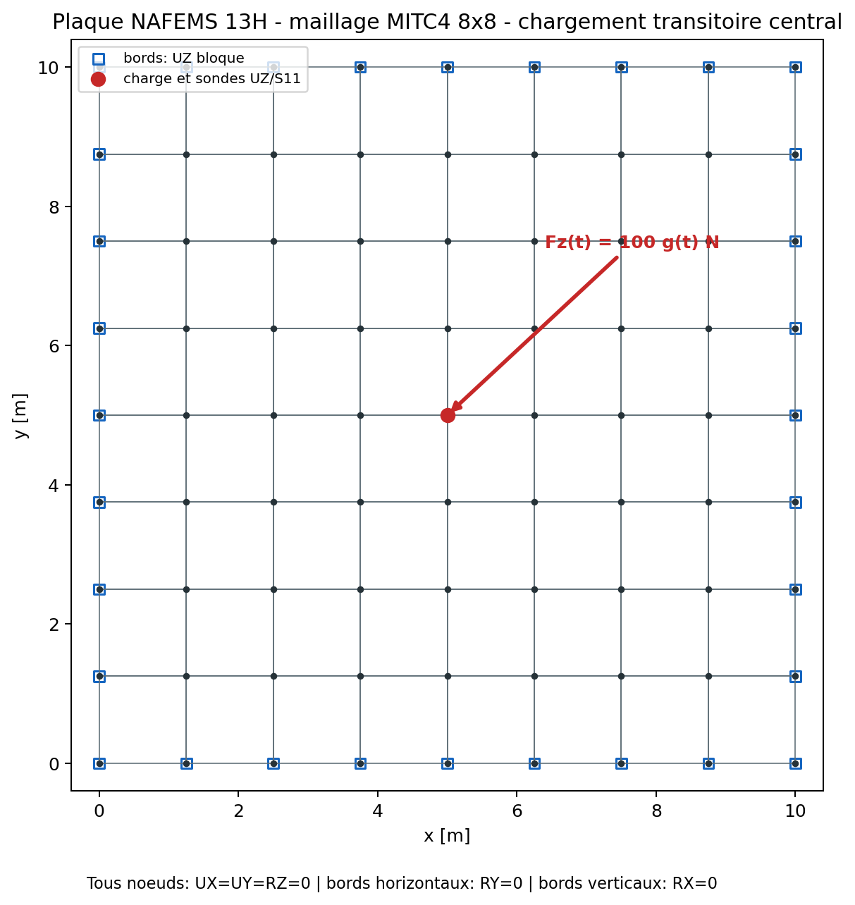

# Revue mecanique MITC4 en dynamique transitoire

## Objet de la revue

Ce document permet la Owner review du scope `mitc4-transient-dynamic` de
QF_solver. Il rassemble la definition mecanique, la formulation temporelle,
les resultats de convergence, les contraintes de face, les bilans d'energie
et la correlation externe Code_Aster.

[Telecharger la version PDF de la revue](../assets/reviews/revue_mitc4_transitoire.pdf)

La campagne automatique est **PASS**. Quentin Farinazzo valide l'etude le
16 juillet 2026 avec la decision `accepted_with_recommendations` pour un usage
`engineering_internal`, sous les limites explicites de la section finale.
Le scope reste `candidate` dans le registre de qualification: la decision est
une validation mecanique interne, pas une qualification ou certification.

| Champ | Valeur avant revue |
| --- | --- |
| Validateur prevu | Quentin Farinazzo |
| Role | auteur et validateur mecanique |
| Mode de revue | `self_review` |
| Independence | `not_independent` |
| Scope | `mitc4-transient-dynamic` |
| Readiness automatique | `PASS`, `14/14` exigences |
| Statut technique | `ready_for_owner_review` |
| Decision Owner | `accepted_with_recommendations` |
| Revendication de certification | aucune |

## Perimetre analyse

Le perimetre candidat couvre:

- coques MITC4 isotropes homogenes d'epaisseur constante par element;
- petits deplacements et petites rotations;
- dynamique lineaire deterministe;
- masse coherente Reissner-Mindlin;
- condensation statique des rotations de drilling sans masse;
- schema Newmark a acceleration moyenne, `beta=0,25`, `gamma=0,5`;
- amortissement de Rayleigh proportionnel a la masse dans ce perimetre;
- charges nodales avec impulsion demi-sinus, chirp lineaire ou table arbitraire;
- deplacements, vitesses, accelerations, energies, residus et contraintes de
  face `S11`, `S22`, `S12`.

Ne sont pas couverts: grandes rotations, flambement, contact, plasticite,
composites, epaisseur variable, excitation de base, PSD, vibration aleatoire,
choc non lineaire, amortissement hysteretique et couplage fluide-structure.

## Modele de controle

La campagne utilise la plaque carree du cas NAFEMS 13H, mais remplace la
pression harmonique par une force nodale temporelle au centre.

| Donnee | Valeur |
| --- | ---: |
| Dimensions | `10 m x 10 m` |
| Epaisseur | `0,05 m` |
| Module d'Young | `200 GPa` |
| Coefficient de Poisson | `0,3` |
| Masse volumique | `8000 kg/m3` |
| Maillage | `8 x 8`, soit `64 MITC4` et `81 noeuds` |
| Noeud charge et sonde | centre, index QF_solver `40` |
| Charge de reference | `Fz = 100 N` |
| Premiere frequence MITC4 | `2,417887758 Hz` |
| Amortissement cible au premier mode | `2 %` |
| Coefficient de Rayleigh | `alpha = 0,607681473 s-1`, `beta_R = 0` |

Les conditions aux limites reproduisent le contrat de plaque simplement
appuyee du cas controle:

- `UX`, `UY` et `RZ` sont bloques sur tous les noeuds;
- `UZ` est bloque sur les quatre bords;
- `RY` est bloque sur les bords horizontaux;
- `RX` est bloque sur les bords verticaux;
- la charge et les sondes `UZ/S11` sont placees au centre.



Point de revue: verifier que ces blocages representent bien le cas de plaque
controle et qu'ils ne doivent pas etre generalises a une coque quelconque.

## Formulation temporelle verifiee

Le systeme semi-discret est:

```text
M a(t) + C v(t) + K u(t) = f(t)
C = alpha M + beta_R K
```

`u`, `v` et `a` designent respectivement le deplacement, la vitesse et
l'acceleration. `M`, `C` et `K` sont les matrices de masse, d'amortissement et
de rigidite.

Newmark utilise:

```text
u_(n+1) = u_n + Delta_t v_n
          + Delta_t^2 [(1/2 - beta) a_n + beta a_(n+1)]

v_(n+1) = v_n
          + Delta_t [(1 - gamma) a_n + gamma a_(n+1)]
```

Avec `beta=1/4` et `gamma=1/2`, la matrice effective est constante:

```text
K_eff = K + [gamma / (beta Delta_t)] C
          + [1 / (beta Delta_t^2)] M
```

La stabilite inconditionnelle du schema lineaire ne garantit pas sa precision.
La verification emploie donc trois pas, `T1/40`, `T1/80` et `T1/160`, et
mesure l'ordre observe.

## Reference temporelle independante

L'oracle ne reprogramme pas Newmark. Il diagonalise le systeme reduit avec des
modes massiquement normalises:

```text
K Phi = M Phi Lambda
Phi^T M Phi = I
```

Chaque coordonnee modale satisfait:

```text
qddot_i + c_i qdot_i + lambda_i q_i = p_i(t)
```

La charge est affine sur chaque intervalle. L'etat augmente
`[q_i, qdot_i, p_i, pdot_i]` est propage exactement par exponentielle de
matrice. Cette preuve est independante de l'integrateur temporel, mais partage
les matrices MITC4: elle verifie le temps, pas la discretisation spatiale.

## Excitations controlees

Trois signaux complementaires sont utilises:

1. **Impulsion demi-sinus**: excitation courte de duree `T1/2`, nulle ensuite.
2. **Chirp lineaire**: balayage de `0,2 f1` a `4 f1` sur quatre periodes.
3. **Table arbitraire**: somme modulee de composantes `0,7 f1`, `2,3 f1` et
   `3,7 f1`, interpolee lineairement.


## Convergence temporelle

### Erreurs RMS de deplacement et contrainte

| Signal | Pas/periode | RMS `UZ` | RMS `S11` | Bilan energie | Residu relatif max |
| --- | ---: | ---: | ---: | ---: | ---: |
| impulsion | 40 | `1,732 %` | `4,452 %` | `0,272 %` | `8,24e-12` |
| impulsion | 80 | `0,960 %` | `3,763 %` | `0,072 %` | `9,79e-12` |
| impulsion | 160 | `0,298 %` | `1,390 %` | `0,018 %` | `9,47e-12` |
| chirp | 40 | `1,216 %` | `1,392 %` | `0,569 %` | `1,76e-11` |
| chirp | 80 | `0,306 %` | `0,394 %` | `0,135 %` | `2,06e-11` |
| chirp | 160 | `0,077 %` | `0,119 %` | `0,034 %` | `2,06e-11` |
| table | 40 | `0,589 %` | `0,528 %` | `0,338 %` | `1,21e-11` |
| table | 80 | `0,147 %` | `0,132 %` | `0,084 %` | `1,39e-11` |
| table | 160 | `0,037 %` | `0,033 %` | `0,021 %` | `1,44e-11` |

Les seuils sont `2 %` sur les erreurs RMS et le bilan d'energie, `3 %` sur les
pics et `1e-7` sur le residu relatif. Tous les criteres passent au pas fin.


### Ordres observes

| Signal | Ordre 40 vers 80 | Ordre 80 vers 160 | Interpretation |
| --- | ---: | ---: | --- |
| impulsion | `0,851` | `1,690` | convergence monotone, ordre reduit par le contenu haute frequence |
| chirp | `1,990` | `1,982` | ordre deux confirme |
| table | `2,003` | `2,000` | ordre deux confirme |

L'impulsion est continue mais sa derivee change brutalement au debut et a la
fin. Elle excite plus fortement les modes eleves; l'ordre asymptotique se
rapproche de deux sans l'atteindre sur ces trois niveaux. Cette observation
est acceptee comme une recommandation de raffinement, pas masquee dans la
conclusion.

## Historiques de deplacement et de contrainte


La contrainte est recuperee au noeud central par moyenne des facettes MITC4
coplanaires adjacentes. `S11` est exprimee dans le repere local de coque et sur
la face superieure `z=+t/2`. Une moyenne nodale ne doit pas etre utilisee pour
masquer une singularite ou un saut de materiau.

## Bilan energetique au pas fin

Le controle emploie:

```text
E_m(t) + integrale de 0 a t de [v^T C v] dtau
       - integrale de 0 a t de [v^T f] dtau = 0

E_m(t) = 0,5 v^T M v + 0,5 u^T K u
```

Le premier terme de `E_m` est l'energie cinetique et le second l'energie de
deformation elastique.

| Signal | Travail externe | Dissipation | Energie finale | Ecart relatif |
| --- | ---: | ---: | ---: | ---: |
| impulsion | `5,4955e-3 J` | `3,2936e-3 J` | `2,2009e-3 J` | `0,0177 %` |
| chirp | `2,3841e-2 J` | `1,3970e-2 J` | `9,8627e-3 J` | `0,0337 %` |
| table | `8,4370e-3 J` | `4,0076e-3 J` | `4,4277e-3 J` | `0,0211 %` |

## Correlation externe Code_Aster

Code_Aster `18.1.0` est execute localement avec la modelisation DKT/DKQ. Le
maillage `8x8`, les blocages, la force, le chirp, le coefficient `alpha` et les
`640` pas sont identiques. La comparaison porte sur les historiques signes.

| Indicateur | Valeur | Critere | Verdict |
| --- | ---: | ---: | --- |
| ecart de pic `UZ` | `5,205 %` | `<= 10 %` | PASS |
| ecart de pic `S11` | `10,509 %` | `<= 15 %` | PASS |
| correlation `UZ` | `0,95430` | `>= 0,90` | PASS |
| correlation `S11` | `0,95602` | `>= 0,85` | PASS |
| ecart RMS `UZ` | `15,783 %` | informatif | trace |
| ecart RMS `S11` | `15,759 %` | informatif | trace |


Les ecarts RMS sont superieurs aux ecarts de pic parce que MITC4
Reissner-Mindlin et DKQ Kirchhoff n'ont pas exactement les memes frequences;
une derive de phase s'accumule sur quatre periodes. Le signe de `S11` n'a pas
necessite d'inversion (`facteur=+1`). L'oracle exponentiel reste la reference
d'acceptation temporelle; Code_Aster est la correlation spatiale externe.

## Synthese des preuves

| Axe de preuve | Resultat | Niveau |
| --- | --- | --- |
| parametres Newmark et valeurs finies | PASS | unitaire |
| residu dynamique | `<= 2,06e-11` | invariant numerique |
| bilan d'energie | `<= 0,034 %` au pas fin | invariant mecanique |
| convergence charges lisses | ordre voisin de `2` | verification analytique |
| impulsion courte | ordre `0,85` puis `1,69` | verification avec recommandation |
| deplacement contre oracle | `<= 0,298 %` RMS | verification temporelle |
| contrainte contre oracle | `<= 1,390 %` RMS | verification temporelle |
| Code_Aster meme maillage | pics et correlations PASS | correlation externe |
| readiness du scope | `14/14` exigences | tracabilite |

## Points a examiner par le validateur

- [x] La geometrie, le maillage et les conditions aux limites sont compris et
  juges coherents pour le cas de controle.
- [x] Les trois excitations couvrent suffisamment le besoin transitoire
  lineaire vise.
- [x] La convergence de `UZ` et `S11` est jugee satisfaisante.
- [x] L'ordre reduit de l'impulsion est accepte avec recommandation de pas fin.
- [x] Les bilans d'energie et residus sont juges satisfaisants.
- [x] La convention de face superieure et de signe de `S11` est acceptee.
- [x] La correlation Code_Aster et ses differences de formulation sont
  comprises et acceptees.
- [x] Les limites d'emploi ci-dessous sont acceptees et seront communiquees
  aux utilisateurs.

## Recommandation technique proposee

L'ensemble des criteres automatiques passe. La decision enregistree accepte le
scope pour un usage engineering interne avec les recommandations suivantes:

| ID | Recommandation | Priorite |
| --- | --- | --- |
| `REC-DYN-TR-001` | imposer une etude de pas pour tout contenu impulsif ou toute frequence d'interet nouvelle | haute |
| `REC-DYN-TR-002` | ajouter un cas dynamique de coque courbe ou distordue | moyenne |
| `REC-DYN-TR-003` | obtenir une extraction native des contraintes Code_Aster | moyenne |
| `REC-DYN-TR-004` | ajouter excitation de base, amortissement modal puis PSD dans des scopes separes | future |
| `REC-DYN-TR-005` | obtenir une revue independante avant toute qualification externe | obligatoire pour qualification |

## Decision du validateur

Cocher une seule decision apres examen:

- [ ] `accepted`
- [x] `accepted_with_recommendations`
- [ ] `rework_required`
- [ ] `rejected`

Commentaires du validateur:

..............................................................................

..............................................................................

| Signature | Valeur a renseigner |
| --- | --- |
| Nom | Quentin Farinazzo |
| Role | auteur et validateur mecanique |
| Date | `2026-07-16` |
| Decision | `accepted_with_recommendations` |
| Signature/revision approuvee | declaration `self_review`; baseline Git propre encore requise |

Cette auto-revue n'est pas une verification independante et ne constitue ni
une certification logicielle ni une qualification externe.

## Preuves et reproductibilite

- `results/VNV-MITC4-NEWMARK-FREE-002/summary.json`
- `results/VNV-MITC4-NEWMARK-DAMPED-FORCED-003/summary.json`
- `results/VNV-MITC4-NEWMARK-BROADBAND-004/summary.json`
- `results/VNV-MITC4-NEWMARK-BROADBAND-004/vnv_manifest.json`
- `results/VNV-MITC4-NEWMARK-CODEASTER-DKQ-005/summary.json`
- `results/VNV-MITC4-NEWMARK-CODEASTER-DKQ-005/nafems13h_newmark.comm`
- `results/VNV-MITC4-NEWMARK-CODEASTER-DKQ-005/code_aster_stdout.log`
- `qualification/reviews/mitc4_transient_dynamic_2026-07-16.json`

Commandes:

```powershell
python .\scripts\run_mitc4_newmark_vnv.py --output .\results\VNV-MITC4-NEWMARK-FREE-002
python .\scripts\run_mitc4_newmark_extended_vnv.py --output .\results\VNV-MITC4-NEWMARK-DAMPED-FORCED-003
python .\scripts\run_mitc4_newmark_broadband_vnv.py --output .\results\VNV-MITC4-NEWMARK-BROADBAND-004
python .\scripts\run_code_aster_newmark_vnv.py --output .\results\VNV-MITC4-NEWMARK-CODEASTER-DKQ-005
python .\qf_solver.py qualification-readiness --scope mitc4-transient-dynamic
```
