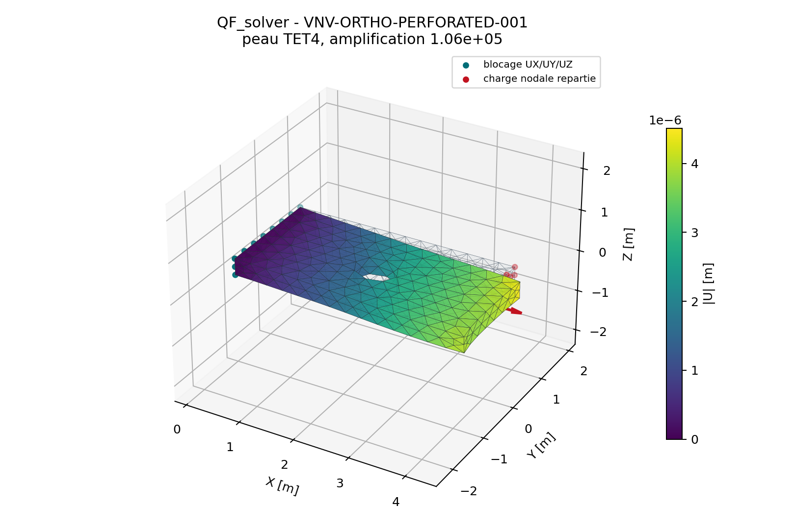
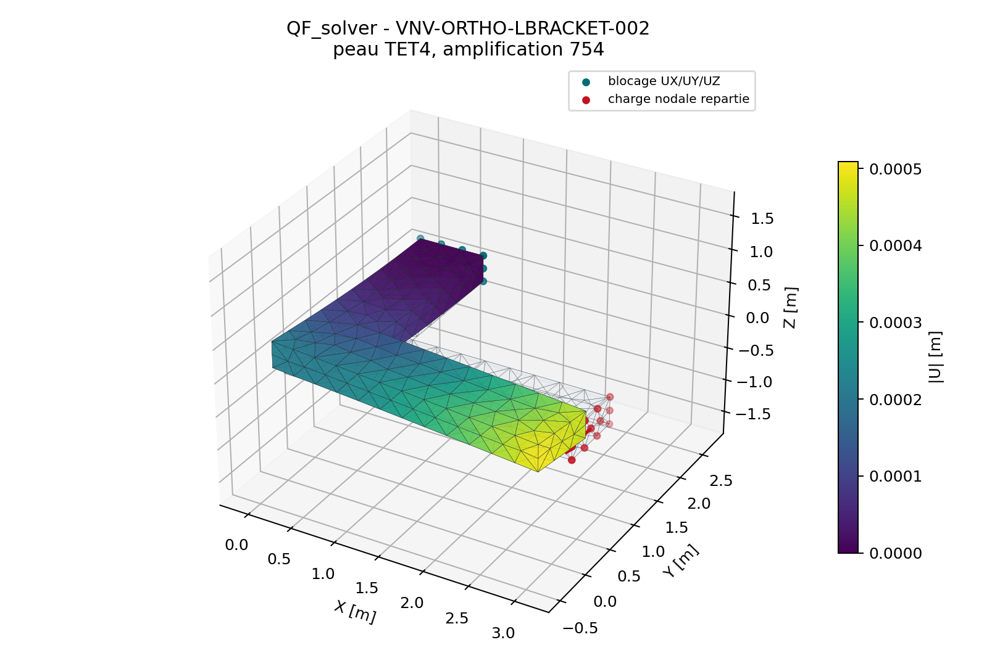
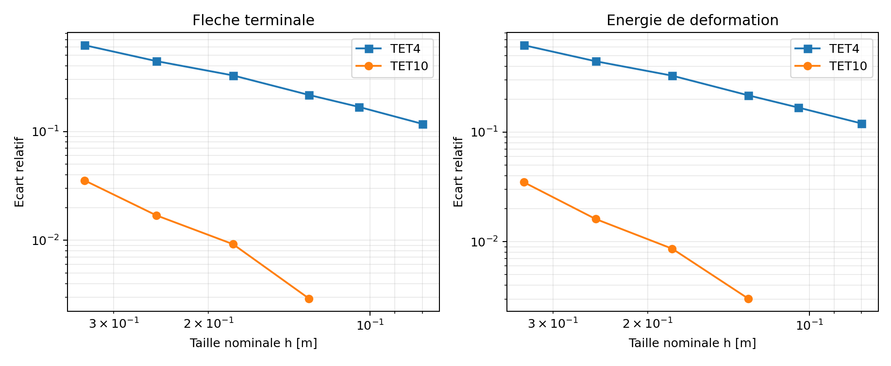

# Revue mecanique des solides orthotropes TET4 et TET10

Cette page trace la decision Owner du scope
`orthotropic-solid-tet4-tet10`. L'enregistrement machine-readable signe est
`qualification/reviews/orthotropic_solids_2026-07-22.json`.

Le dossier est accepte en revue interne par Quentin Farinazzo avec le statut
**accepted_with_recommendations** pour un usage `engineering_internal_candidate`,
sans revendication de certification.

## Perimetre propose

- elements solides `TET4` et `TET10`;
- elasticite lineaire orthotrope 3D homogene;
- petites deformations et petits deplacements;
- orientation materiau constante par region ou par materiau;
- statique lineaire uniquement;
- resultats en axes globaux et materiau lorsque disponibles;
- type `orthotropic_3d` et type `composite_orthotropic_3d` homogeneise avec
  provenance tracee.

Restent hors perimetre : orientation variable aux points d'integration et
suivi automatique d'un repere materiau sur une geometrie courbe,
modelisation pli par pli qualifiee, delaminage, elements cohesifs,
endommagement progressif, plasticite anisotrope et grandes deformations.

Les contraintes proches des singularites ne sont plus exclues par principe.
Elles font l'objet d'une action V&V ouverte : classification de la singularite,
raffinements successifs, chemins a distance controlee et grandeurs
regularisees. Un pic ponctuel situe exactement sur une singularite mathematique
ne peut toutefois pas etre exige convergent vers une valeur finie.

## Convention d'orientation et pieces courbes

La matrice `orientation`, notee ici `R`, contient en colonnes les axes materiau
`e1`, `e2`, `e3` exprimes dans le repere global. Le passage global vers
materiau est applique sur les tenseurs, et non par une permutation de Voigt :

\[
\varepsilon_m=R^T\varepsilon_gR,\qquad
\sigma_g=R\sigma_mR^T.
\]

Les cisaillements de deformation sont des cisaillements d'ingenieur dans les
vecteurs de Voigt. Cette convention et sa transformation sont acceptees par la
revue du `2026-07-22`.

Pour une piece courbe, le comportement actuel est le suivant :

- une orientation est constante pour un materiau donne;
- plusieurs zones peuvent suivre approximativement la courbure en affectant
  plusieurs materiaux de memes constantes mais d'orientations differentes;
- le code ne construit pas encore automatiquement un repere tangent continu a
  partir de la normale ou d'un champ de fibres;
- il n'interpole pas encore l'orientation aux points d'integration.

Une piece courbe a orientation globale constante est donc correctement
calculee. Une piece dont les fibres suivent la courbure doit, dans le perimetre
actuel, etre decoupee en regions orientees. Le suivi continu de courbure reste
une extension a qualifier avant acceptation externe.

## Elements a valider

| Question | Preuve | Statut technique |
| --- | --- | --- |
| Loi 3D positive, symetrique et reciproque | `SPEC-COMP-SOLID-001` | PASS |
| Tractions analytiques axes 1/2/3 | `SPEC-COMP-SOLID-002` | PASS |
| Cisaillements purs 12/13/23 | `SPEC-COMP-SOLID-003` | PASS |
| Patch affine TET4/TET10 repere tourne | `SPEC-COMP-SOLID-004` | PASS |
| Objectivite sous rotation globale | `SPEC-COMP-SOLID-005` | PASS |
| Convergence structurelle hors axes | `SPEC-COMP-SOLID-006` | PASS avec reserve TET4 |
| Correlation externe Code_Aster/CalculiX | `SPEC-COMP-SOLID-007` | PASS |
| Non-regression isotrope | `SPEC-COMP-SOLID-008` | PASS |

## Synthese des resultats

### Noyau elementaire

La campagne `VNV-ORTHOTROPIC-SOLID-KERNEL-001` couvre la loi materiau, les
six etats unitaires, les patchs affines TET4/TET10, les six modes rigides et
l'invariance sous rotation globale.

| Indicateur | TET4 | TET10 | Critere |
| --- | ---: | ---: | ---: |
| erreur patch affine deformation | `0` | `6,06e-17` | `<= 1e-10` |
| erreur patch affine contrainte | `0` | `2,16e-16` | `<= 1e-10` |
| residu maximal modes rigides | `4,23e-17` | `3,46e-17` | `<= 1e-10` |

Rapport : `qualification/vnv/orthotropic_solid_kernel/reference/report.md`.

### Correlation externe

La campagne `VNV-ORTHOTROPIC-SOLID-EXTERNAL-002` compare QF_solver a
Code_Aster `18.1.0` et CalculiX `2.20` sur les memes noeuds, les memes
tetraedres, les memes blocages et les memes charges.

| Cas | Ecart champ U CalculiX | Ecart champ U Code_Aster | Ecart pic von Mises Code_Aster |
| --- | ---: | ---: | ---: |
| eprouvette 3D perforee | `0,000132 %` | `3,60e-11 %` | `2,59e-12 %` |
| equerre 3D a angle rentrant | `0,000116 %` | `3,42e-10 %` | `5,78e-10 %` |

Ces ecarts valident fortement la rigidite orthotrope, l'orientation materiau,
les conditions aux limites et l'assemblage sur maillages identiques. Les pics
de contrainte proches du trou et de l'angle rentrant doivent maintenant etre
traites dans une campagne de convergence specifique, conformement a la decision
du validateur.





Rapport : `qualification/vnv/external/orthotropic_solids/reference/report.md`.

### Convergence structurelle

La campagne `VNV-ORTHOTROPIC-SOLID-CONVERGENCE-003` utilise un porte-a-faux
massif `2,0 x 1,0 x 0,5 m`, une orientation materiau de 30 degres et une
traction terminale transverse de `-1 MPa`. Un maillage TET10 plus fin sert de
reference numerique.

| Famille | Elements grossier -> fin | Ecart fleche grossier -> fin | Ecart energie fin | Interpretation |
| --- | ---: | ---: | ---: | --- |
| TET4 | `215 -> 9 820` | `62,07 % -> 11,75 %` | `11,99 %` | convergence monotone confirmee, mais lente en flexion |
| TET10 | `215 -> 2 607` | `3,55 % -> 0,292 %` | `0,303 %` | tres bon niveau engineering |

Points TET4 ajoutes a la demande du validateur :

| Taille nominale | Elements | Fleche terminale | Ecart fleche | Ecart energie | Residu libre |
| ---: | ---: | ---: | ---: | ---: | ---: |
| `0,105 m` | `4 951` | `-4,254439e-3 m` | `16,828 %` | `16,773 %` | `2,04e-12` |
| `0,080 m` | `9 820` | `-4,514090e-3 m` | `11,752 %` | `11,990 %` | `3,40e-12` |



Les deux nouveaux points excluent une divergence sur cette sequence : erreurs
de fleche et d'energie decroissent sans inversion, et l'increment de fleche
entre les deux derniers niveaux vaut `6,10 %`. Le TET4 est acceptable comme
element lineaire convergent avec recommandation de raffinement, mais ne doit
pas etre presente comme element de precision fine en flexion orthotrope sur
maillage courant. Le TET10 reste recommande pour les pieces orthotropes
dominees par la flexion, les gradients de contrainte et les zones courbes.

Rapport : `qualification/vnv/orthotropic_solid_convergence/reference/report.md`.

### Non-regression isotrope

La campagne `VNV-ORTHOTROPIC-ISOTROPIC-NONREGRESSION-004` compare le chemin
historique isotrope a une loi orthotrope mathematiquement isotrope, tournee de
27 degres.

| Indicateur | Valeur |
| --- | ---: |
| erreur rigidite TET4 | `2,50e-16` |
| erreur contrainte TET4 | `1,01e-16` |
| erreur rigidite TET10 | `1,92e-16` |
| erreur contrainte TET10 | `1,20e-16` |
| ratio temps isotrope/orthotrope TET4 | `0,961` |
| ratio temps isotrope/orthotrope TET10 | `1,025` |

Le chemin isotrope TET4/TET10 reste donc numeriquement preserve. La mise en
cache de la matrice isotrope ne change pas les resultats et ameliore le cout du
chemin historique.

Rapport :
`qualification/vnv/orthotropic_isotropic_performance/reference/report.md`.

## Checklist de decision Owner

- [x] Accepter la definition des constantes `E1/E2/E3`, `nu12/nu13/nu23` et
  `G12/G13/G23`.
- [x] Accepter la convention d'orientation : les colonnes de `orientation`
  sont les axes materiau exprimes dans le repere global. L'orientation est
  appliquee element par element depuis le materiau affecte; l'extension courbe
  continue reste ouverte.
- [x] Accepter la transformation globale/materiau en notation de Voigt avec
  cisaillements d'ingenieur.
- [x] Accepter les patchs affines TET4/TET10 et l'invariance par rotation.
- [x] Accepter la correlation Code_Aster/CalculiX sur eprouvette perforee et
  equerre 3D.
- [x] Accepter le TET10 orthotrope pour le perimetre statique lineaire borne.
- [x] Accepter le TET4 orthotrope avec recommandation de raffinement/TET10 en
  flexion.
- [x] Definir et executer une methode d'acceptation des contraintes proches des
  singularites. L'exclusion globale proposee est refusee par le validateur;
  la campagne QF_solver/Code_Aster/CalculiX requiert encore du raffinement
  avant acceptation locale.
- [x] Confirmer que `composite_orthotropic_3d` est un materiau homogeneise
  trace, pas une qualification composite pli par pli.
- [x] Confirmer qu'aucune revendication de certification externe n'est faite.

## Decision proposee

Decision proposee : **accepted_with_recommendations**.

Recommandations proposees :

1. Utiliser preferentiellement `TET10` pour les structures orthotropes dominees
   par flexion, courbure ou gradients de contrainte.
2. Realiser en fin de developpement une campagne finale sur pieces composites
   complexes, chargements combines, maillages plus grands et correlations
   multi-solveurs.
3. Obtenir une Owner review independante avant toute qualification externe.
4. Qualifier un champ d'orientation continu pour les pieces courbes et les
   directions de fibres variables.
5. Ajouter des scopes orthotropes modal et dynamique apres qualification de la
   masse TET4/TET10.
6. La campagne de contraintes proches des singularites est completee sur huit
   raffinements avec chemins a distance fixe et moyennes de bande. Le verdict
   machine est `PASS_STRESS_ACCEPTANCE`.
7. Conserver la bande nodale CalculiX de l'angle rentrant comme diagnostic :
   l'ecart `6,357 %` provient d'un operateur d'extrapolation different. Pour
   toute decision locale, utiliser l'observable convergee et la correlation
   Code_Aster aux points d'integration, pas le pic singulier.

## Decision et signature

Decision du 22 juillet 2026 : **accepted_with_recommendations**.

Validateur et signataire : **Quentin Farinazzo**, auteur et validateur
mecanique. Signature : **declaration electronique self_review du 22 juillet
2026**.

Cette decision accepte le perimetre statique lineaire borne. Elle ne constitue
ni une verification independante ni une certification. L'enregistrement
machine-readable est
`qualification/reviews/orthotropic_solids_2026-07-22.json`.

## Commandes utiles

```powershell
python .\qf_solver.py qualification-readiness --scope orthotropic-solid-tet4-tet10
python .\scripts\run_orthotropic_solid_vnv.py --output .\results\VNV-ORTHOTROPIC-SOLID-KERNEL-001
python .\scripts\run_orthotropic_external_vnv.py --output .\results\VNV-ORTHOTROPIC-SOLID-EXTERNAL-002 --mesh-size 0.30
python .\scripts\run_orthotropic_convergence_vnv.py --output .\results\VNV-ORTHOTROPIC-SOLID-CONVERGENCE-003
python .\scripts\run_orthotropic_performance_vnv.py --output .\results\VNV-ORTHOTROPIC-ISOTROPIC-NONREGRESSION-004
python .\scripts\run_orthotropic_singularity_vnv.py --output .\results\VNV-ORTHOTROPIC-SINGULAR-STRESS-005
```
