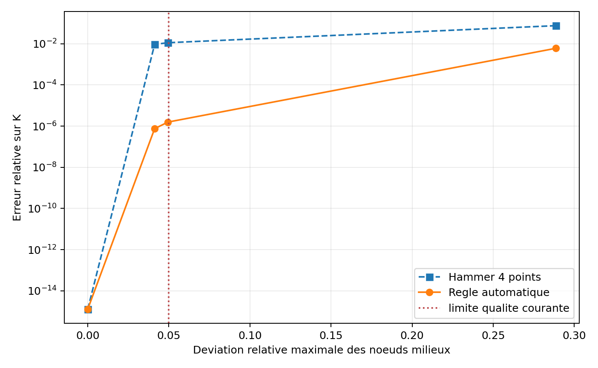
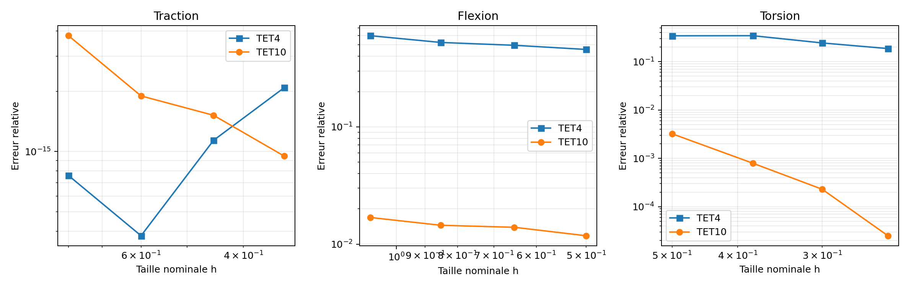
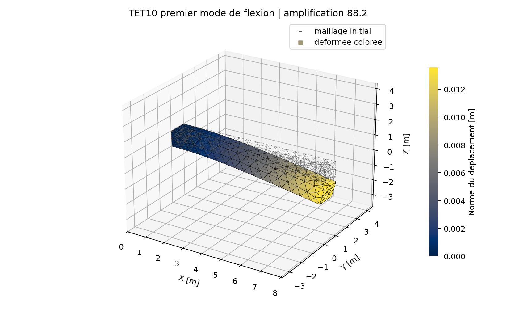
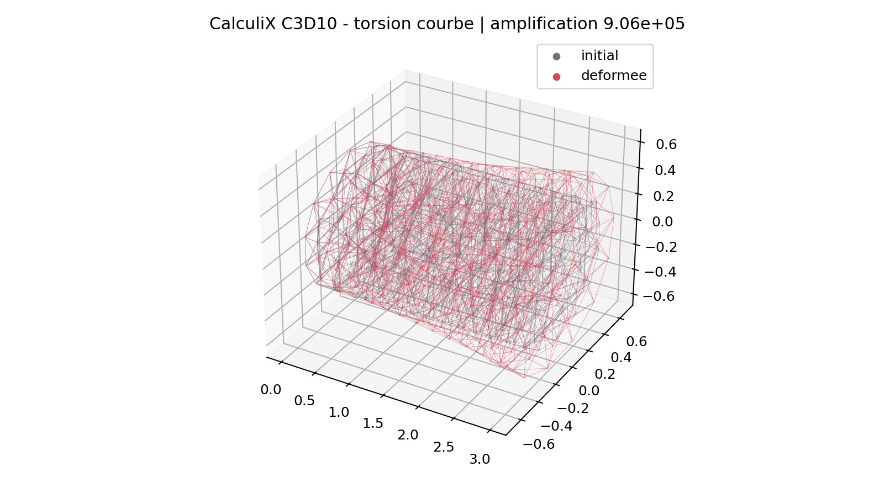
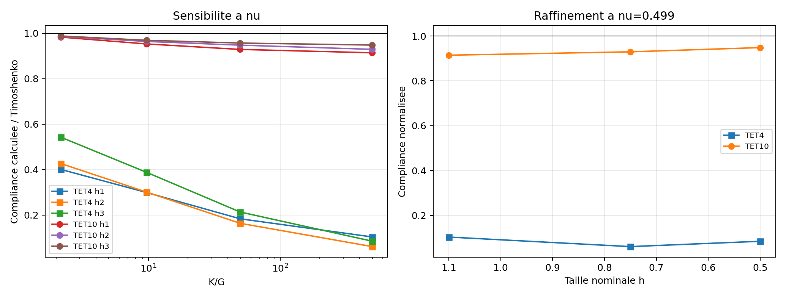

# Revue mecanique TET10 lineaire

[Telecharger la revue PDF autonome](../assets/reviews/revue_mecanique_tet10_lineaire.pdf)

Cette revue borne le TET10 isotrope en petites deformations. Elle ne constitue
ni une certification, ni une revue independante. Le dossier automatique est
techniquement complet et la decision Owner est enregistree au 18 juillet
2026.

## Perimetre propose

- elasticite lineaire isotrope, petits deplacements;
- geometries droites ou courbes respectant les controles de Jacobien;
- quadrature Hammer-4 sur elements droits et Duffy-64 sur elements courbes;
- rigidite, masse coherente, statique, modal et charges coherentes T6;
- traction, flexion, torsion et pression sur les cas documentes;
- post-traitement nodal comme recuperation, hors singularites.

Restent hors perimetre : incompressibilite exacte, formulation mixte `u-p`,
plasticite TET10 courbe, grandes transformations TET10 et usage industriel
autonome.

## Modeles reellement calcules

| ID | Geometrie et maillage | Blocages et chargement | Reference |
| --- | --- | --- | --- |
| `011` | TET10 isole droit, courbe, limite qualite et distordu | champs affines et modes rigides imposes | quadrature Duffy ordre 8 |
| `012-T` | prisme `2 x 1 x 0,5 m`, 4 maillages de 78 a 215 TET4/TET10 | symetries normales, traction `10 MPa` en bout | Hooke uniaxial |
| `012-B` | porte-a-faux `8 x 1 x 1 m`, 4 maillages de 163 a 370 TET4/TET10 | encastrement en pied, traction terminale `-1000 Pa` suivant Z | poutre de Timoshenko |
| `012-R` / `014` | arbre circulaire `L=3 m`, `R=0,5 m`, 4 maillages de 151 a 1063 elements | pied bloque, couple coherent `1000 N.m` en bout | Saint-Venant et CalculiX C3D10 |
| `013-A` | un TET10 courbe et une face T6 courbe | pression `2 Pa`, champ affine, masse volumique `7800 kg/m3` | integration haute precision |
| `013-M` | porte-a-faux TET10 `8 x 1 x 1 m`, 370 elements, 841 noeuds, 2523 DDL | pied encastre, vibration libre | Euler-Bernoulli |
| `015` | meme porte-a-faux, 3 maillages et `nu=0,30/0,45/0,49/0,499` | pied encastre, traction terminale `-1000 Pa` | Timoshenko et TET4 temoin |

Les maillages structures sont generes de maniere deterministe avec Gmsh. Les
familles TET4 et TET10 partagent les memes tailles nominales et le meme nombre
d'elements par niveau; le TET10 ajoute les noeuds milieux d'aretes.

## Synthese des preuves

| Etude | Preuve principale | Pire indicateur | Verdict automatique |
| --- | --- | ---: | --- |
| `011` Jacobien/quadrature | Duffy ordre 8 | erreur courbe `7,51e-7` | PASS |
| `012` convergence | Hooke/Timoshenko/Saint-Venant | flexion `1,179 %` | PASS |
| `013` masse/modal/charges | masse, pression, Euler-Bernoulli | frequence `0,434 %` | PASS |
| `014` CalculiX C3D10 | meme maillage courbe | champ complet `6,84e-5` | PASS |
| `015` quasi-incompressible | Timoshenko, temoin TET4 | TET10 `5,17 %` a `nu=0,499` | PASS caracterisation |

## Geometrie et quadrature

La campagne `011` distingue les elements droits des elements courbes. Les
Jacobiens sont echantillonnes sur 35 points avant assemblage. Un Jacobien non
positif est refuse. Sur le cas courbe admissible, la regle automatique atteint
`7,51e-7` d'erreur matricielle face a une quadrature Duffy d'ordre 8, contre
`9,28e-3` pour Hammer-4.

## Convergence structurelle

Sur quatre raffinements, le patch de traction est exact au bruit machine. Le
maillage TET10 fin atteint `1,179 %` d'erreur en flexion et `0,00250 %` sur la
rotation de torsion. L'erreur L2 de contrainte en torsion vaut `0,991 %`.

## Masse, modal et charges

La masse coherente courbe est confirmee a `3,57e-16`. La pression T6 conserve
resultante et moment a `9,10e-18` et `4,71e-16`. La premiere paire de flexion
vaut `12,7961 / 12,7965 Hz` contre `12,8519 Hz` pour Euler-Bernoulli, soit
`0,434 %` au maximum.

## Correlation externe

CalculiX 2.20 utilise 1 063 C3D10, 1 992 noeuds, la meme connectivite, les
memes coordonnees courbes, blocages et charges nodales. Les ecarts relatifs
valent `6,84e-5` sur le champ de deplacement complet et `6,45e-5` sur la
rotation terminale.

## Quasi-incompressibilite

A `nu=0,499`, le TET4 temoin ne conserve que `8,48 %` de la compliance de
Timoshenko. Le TET10 en conserve `94,83 %`, soit une erreur de `5,17 %`. Ce
resultat demontre une resistance nettement superieure au verrouillage sur ce
cas, mais ne remplace pas une formulation mixte pour `nu=0,5`.

## Checklist de decision

- [x] Accepter l'ordre nodal, le mapping isoparametrique et le controle des Jacobiennes.
- [x] Accepter la regle Hammer-4 pour les elements droits.
- [x] Accepter la regle Duffy-64 pour les geometries courbes admissibles.
- [x] Accepter la convergence en traction, flexion et torsion dans le domaine documente.
- [x] Accepter la masse coherente, le modal et les charges de face T6.
- [x] Accepter la correlation CalculiX C3D10 sur maillage identique.
- [x] Accepter la caracterisation jusqu'a `nu=0,499` avec recommandation, sans qualifier `nu=0,5`.
- [x] Confirmer les exclusions et le statut non certifie pour l'usage industriel autonome.

## Recommandation avant acceptation totale

Avant une acceptation totale ou une qualification externe, executer en toute
fin de developpement une campagne beaucoup plus large que les cas elementaires
actuels. Cette campagne devra couvrir plusieurs pieces et assemblages complexes,
des maillages nettement plus importants, des chargements combines, des zones de
concentration de contraintes et des comparaisons independantes avec plusieurs
codes de reference, notamment Conastin, CalculiX et Code_Aster. La designation
et la version de Conastin devront etre precisees lors de la preparation de cette
campagne finale.

Cette recommandation ne bloque pas l'acceptation interne actuelle du perimetre
borne. Elle constitue le dernier passage V&V a realiser lorsque l'ensemble des
fonctionnalites prevues aura ete implemente.

## Decision et signature

Decision du 18 juillet 2026 : **accepted_with_recommendations**.

Validateur et signataire : **Quentin Farinazzo**, auteur et validateur
mecanique. Signature : **declaration electronique self_review du 18 juillet
2026**.

Cette auto-revue n'est pas independante et ne constitue pas une certification.
Enregistrement machine-readable :
`qualification/reviews/tet10_linear_2026-07-18.json`.
