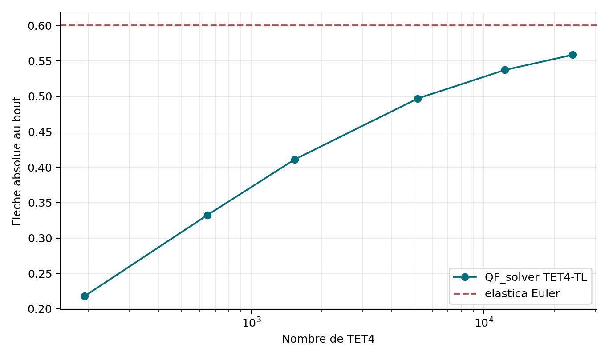
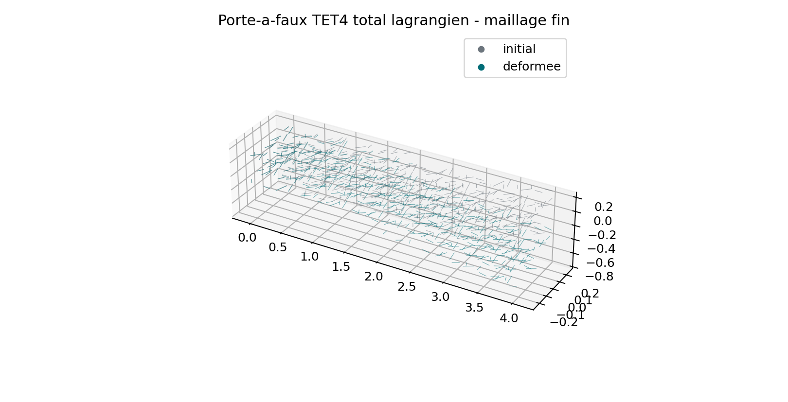
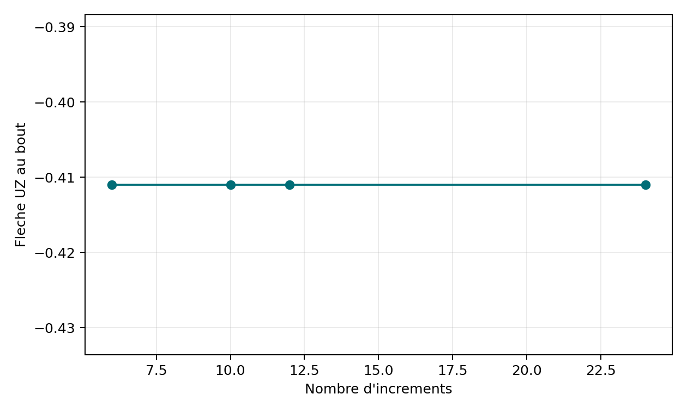
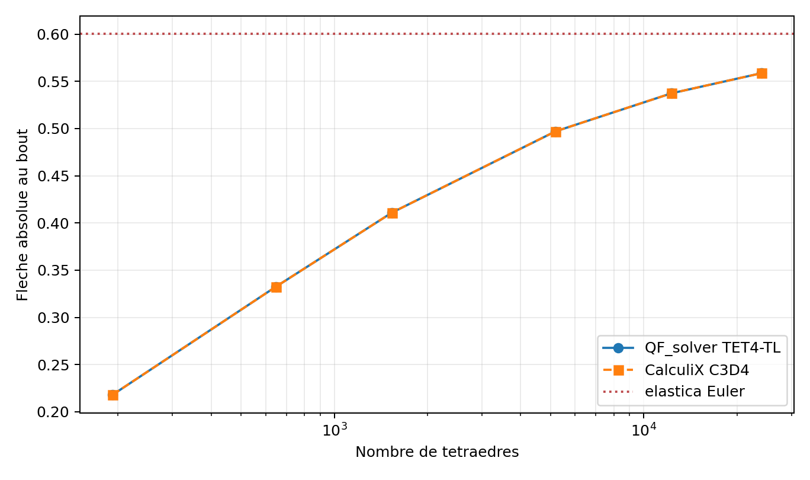
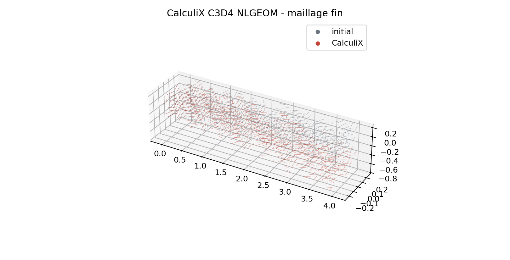

# Revue TET4 total lagrangien

Le noyau elementaire est controle par `VNV-TET4-TL-KERNEL-001`. La campagne
assemblee `VNV-TET4-TL-ASSEMBLY-002` couvre six niveaux, de `192` a `24 000`
TET4, soit jusqu'a `14 883` DDL.

```powershell
python .\scripts\run_tet4_total_lagrangian_vnv.py
python .\scripts\run_tet4_total_lagrangian_assembly_vnv.py
python .\scripts\run_tet4_tl_step_sensitivity.py
python .\scripts\run_calculix_tet4_tl_vnv.py
```

## Invariants assembles

| Controle | Pire valeur | Limite | Verdict |
| --- | ---: | ---: | --- |
| Equilibre du patch affine interieur | `6,16e-15` | `1e-12` | PASS |
| Force parasite sous rotation rigide | `2,35e-15` | `1e-13` | PASS |
| Residu Newton relatif | `7,97e-11` | `1e-8` | PASS |
| `det(F)` minimal | `0,9806` | `> 0,2` | PASS |

## Convergence spatiale

La fleche passe de `-0,2179` a `-0,3325`, `-0,4110`, `-0,4971`, `-0,5374`,
puis `-0,5587`. Sa variation entre les deux derniers maillages vaut `3,81 %`,
sous l'objectif de `5 %`.

L'elastica d'Euler en charge morte donne `-0,60013`. L'ecart du maillage fin
vaut `6,91 %`, sous la limite comparative de `10 %`. Cette reference neglige
le cisaillement transverse et les effets locaux 3D; elle ne valide donc pas les
contraintes locales.





## Sensibilite aux increments

`VNV-TET4-TL-STEPS-004` compare `3/6/10/12/24` increments sur `1536` TET4. Trois
increments ne convergent pas. Les cas `6/10/12/24` donnent tous
`UZ=-0,4110074232562`, avec un ecart maximal `8,10e-16`. La tendance de fleche
est donc spatiale, pas un equilibre Newton incomplet. Le minimum technique est
fixe a six increments; la recommandation et la valeur par defaut valent dix.



## Correlation CalculiX

`VNV-TET4-TL-CALCULIX-003` execute CalculiX `2.20` dans Docker avec la meme
connectivite C3D4, les memes blocages et les memes charges nodales. Le manuel
CalculiX definit `*ELASTIC + NLGEOM` avec Green-Lagrange et Piola-Kirchhoff 2 :
la loi correspond au Saint-Venant-Kirchhoff de QF_solver.

L'ecart maximal de fleche sur les six maillages vaut `1,86e-7` relatif; il vaut
`5,39e-8` sur le maillage fin. La precision d'ecriture FRD limite cette mesure.

[Reference constitutive CalculiX](https://www.feacluster.com/CalculiX/ccx_2.18/doc/ccx/node260.html)





## Performance observee

La vectorisation et la mise en cache reduisent les trois anciens niveaux
d'environ `198,7 s` a `6,69 s` sur la machine de campagne. Le niveau `24 000`
TET4 demande environ `363 s` et atteint environ `296 Mo`. Ces mesures sont
informatives et non portables.

## Revue demandee a Quentin Farinazzo

- [x] Accepter Green-Lagrange comme mesure de deformation du scope.
- [x] Accepter Piola-Kirchhoff 2 comme mesure de contrainte constitutive.
- [x] Accepter Saint-Venant-Kirchhoff comme loi de verification, non comme loi
  universelle de grandes deformations.
- [x] Confirmer les charges mortes, le minimum technique de six increments et
  la valeur recommandee/par defaut de dix increments.
- [x] Accepter les invariants de l'assemblage multi-elements.
- [x] Accepter la convergence de la fleche globale face au raffinement, a
  l'elastica et a CalculiX, avec recommandation sur le cout du TET4.
- [x] Maintenir temporairement contraintes, flambement, post-flambement, pression suiveuse,
  contact et plasticite finie hors validation.
- [x] Autoriser le passage aux benchmarks structurels suivants en conservant le
  statut `research`.

Decision du 18 juillet 2026 : **accepted_with_recommendations**.

Mode : **self_review**, Quentin Farinazzo etant auteur et validateur mecanique.
Cette decision ne constitue pas une revue independante ni une certification.

Enregistrement machine-readable :
`qualification/reviews/tet4_total_lagrangian_2026-07-18.json`.

Cette revue peut accepter le noyau, ses invariants assembles et la fleche globale
de ce porte-a-faux avec recommandation. Une seconde revue reste necessaire pour
les contraintes, le flambement et le post-flambement.

Cette seconde revue a ete terminee le 18 juillet 2026. Elle est disponible dans
[la revue structurelle V2](revue_tet4_total_lagrangian_structural_v2.md) et
remplace les exclusions temporaires ci-dessus pour le perimetre qu'elle borne.

Les preuves automatisees de cette seconde etape sont maintenant disponibles
dans [la campagne structurelle V2](tet4_total_lagrangian_structural_v2.md). Leur
passage automatise ne vaut pas encore decision mecanique humaine.
