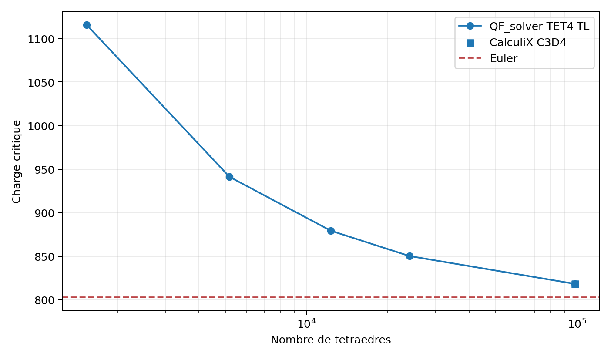
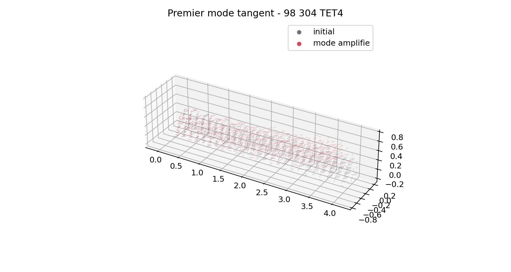

# Revue mecanique TET4 total lagrangien structurel V2

## Decision

Decision du 18 juillet 2026 : **accepted_with_recommendations** pour un usage
engineering interne au statut `research`.

Validateur : **Quentin Farinazzo**, auteur et validateur mecanique. La revue est
une `self_review`, donc non independante. Elle ne constitue ni une qualification
externe ni une certification.

## Domaine accepte

- deformation de Green-Lagrange et loi Saint-Venant-Kirchhoff ;
- contrainte de Piola-Kirchhoff 2 et push-forward vers Cauchy ;
- energie interne et determinant positif du gradient de deformation ;
- charge critique par tangente precontrainte ;
- convergence jusqu'a `98 304` TET4 et `56 355` DDL ;
- imperfections deterministes `e0/L = 0.0025`, `0.005` et `0.01` ;
- continuation arc-length creuse sur 120 pas ;
- correlations externes CalculiX et Code_Aster ;
- solveur public `geometric_nonlinear_static` dans ses limites documentees.

## Grille de revue

| Point examine | Preuve | Resultat | Decision |
| --- | --- | ---: | --- |
| Push-forward PK2 vers Cauchy | `VNV-TET4-TL-STRESS-005` | erreur interne `< 1e-11` | accepte |
| Cauchy externe | CalculiX C3D4 | erreur relative `1.17e-7` | accepte |
| PK2 externe | Code_Aster TETRA4 | erreur relative `8.54e-5` | accepte |
| Charge critique h4 | 24 000 TET4 | erreur Euler `5.870 %` | accepte avec raffinement demande |
| Charge critique h5 | 98 304 TET4 | erreur Euler `1.896 %` | accepte |
| Oracle externe h5 | CalculiX C3D4 | ecart QF/CCX `0.0343 %` | accepte |
| Imperfection faible | `e0/L=0.0025` | chemin continu, residu `< 1e-8` | accepte |
| Imperfection moyenne | `e0/L=0.005` | chemin continu, residu `< 1e-8` | accepte |
| Imperfection forte | `e0/L=0.01` | chemin continu, residu `< 1e-8` | accepte |
| Branche externe precritique | Code_Aster jusqu'a `0.8 Pcr` | ecart `1.69e-9` | accepte |

## Confirmation du raffinement h5

La reference analytique de la colonne encastree-libre est :

\[
P_{cr}^{Euler}=\frac{\pi^2 E I}{4L^2}=803.190462.
\]

| Niveau | TET4 | DDL | Pcr QF_solver | Ecart Euler | Pcr CalculiX | Ecart QF/CCX |
| --- | ---: | ---: | ---: | ---: | ---: | ---: |
| h4 | 24 000 | 14 883 | 850.340348 | 5.870 % | 850.640100 | 0.035 % |
| h5 | 98 304 | 56 355 | 818.415402 | 1.896 % | 818.696000 | 0.034 % |

Le raffinement reduit donc l'erreur Euler de `3.974` points. La charge critique
diminue vers la reference analytique, tandis que l'accord avec CalculiX reste
pratiquement inchange. Cela confirme une convergence spatiale lente du TET4 en
flexion, et non une divergence du solveur.





## Recommandations maintenues

1. Raffiner fortement les zones dominees par la flexion avec le TET4.
2. Relancer le point h5 pour les baselines de release majeures, pas dans la CI rapide.
3. Obtenir une revue independante avant toute qualification externe.
4. Completer une correlation externe au-dela du maximum post-critique si cette
   partie devient un domaine d'emploi operationnel.

## Hors domaine

Restent exclus : pression suiveuse, contact, plasticite en deformation finie,
endommagement, rupture, imperfections aleatoires et contraintes extrapolees aux
singularites.

## Reproduction

```powershell
python .\scripts\run_tet4_tl_stress_vnv.py
python .\scripts\run_tet4_tl_buckling_vnv.py
python .\scripts\run_tet4_tl_postbuckling_vnv.py
python .\scripts\run_calculix_tl_structural_vnv.py --output .\results\VNV-TET4-TL-CALCULIX-STRUCTURAL-008
python .\scripts\run_code_aster_tl_structural_vnv.py --output .\results\VNV-TET4-TL-CODEASTER-STRUCTURAL-009
python .\scripts\run_tet4_tl_buckling_refinement.py
```

Enregistrement machine-readable :
`qualification/reviews/tet4_total_lagrangian_structural_v2_2026-07-18.json`.
