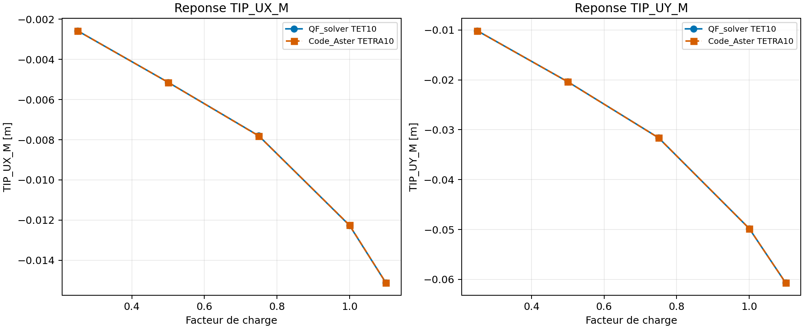
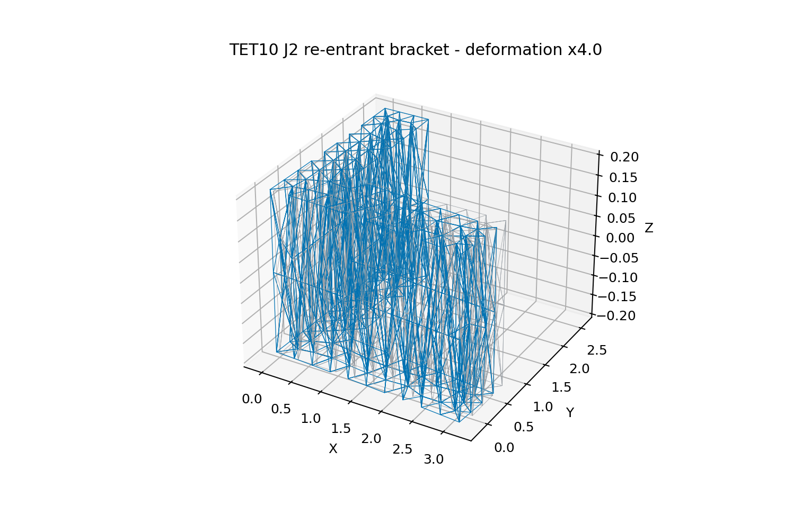

# Benchmark complexe TET10 J2 avec Code_Aster

Cette campagne etend la preuve TET10 J2 a une geometrie rentrante et a un
chargement combine. QF_solver TET10 et Code_Aster TETRA10 utilisent le meme
maillage, les memes blocages et les memes forces nodales. Le resultat est une
preuve externe de developpement ; une Owner review distincte reste necessaire.

## Modele et chargement

La piece est un support en L obtenu par fusion de deux volumes. Le maillage
quadratique contient `1 039 noeuds` et `457 elements TET10/TETRA10`. La face
superieure du montant est encastree sur `UX`, `UY` et `UZ`. La face terminale
du bras horizontal recoit deux charges reparties : `FX = 3 MN` et `FY = -6 MN`.

Le materiau est une plasticite J2 isotrope a petites deformations :
`E = 210 GPa`, `nu = 0,30`, limite d'elasticite `250 MPa` et ecrouissage
isotrope `50 GPa`. Les facteurs de charge sont `0,25`, `0,50`, `0,75`, `1,00`
et `1,10`.

## Resultats

| Facteur | UX QF [m] | UX Code_Aster [m] | UY QF [m] | UY Code_Aster [m] | PEEQ QF | PEEQ Code_Aster |
| ---: | ---: | ---: | ---: | ---: | ---: | ---: |
| 0,25 | -2,567112e-03 | -2,567112e-03 | -1,014336e-02 | -1,014336e-02 | 0,000000e+00 | 0,000000e+00 |
| 0,50 | -5,138363e-03 | -5,137959e-03 | -2,039115e-02 | -2,039402e-02 | 1,342440e-06 | 8,531716e-07 |
| 0,75 | -7,805079e-03 | -7,812636e-03 | -3,160803e-02 | -3,162449e-02 | 1,519731e-05 | 1,303063e-05 |
| 1,00 | -1,226668e-02 | -1,225527e-02 | -4,980779e-02 | -4,980008e-02 | 1,222393e-04 | 1,159877e-04 |
| 1,10 | -1,512134e-02 | -1,511538e-02 | -6,065789e-02 | -6,066084e-02 | 2,169775e-04 | 2,113254e-04 |





## Controles

| Controle | Valeur | Limite | Statut |
| --- | ---: | ---: | --- |
| RMS chemin deplacement combine | 0,01245 % | 10 % | PASS |
| Ecart final deplacement combine | 0,00227 % | 10 % | PASS |
| RMS chemin PEEQ moyen | 1,84443 % | 15 % | PASS |
| Ratio deplacement final / longueur globale | 1,95357 % | 10 % | PASS |
| Residu QF maximal | 1,97226e-09 | 1e-7 | PASS |

La PEEQ est comparee comme moyenne des points d'integration dans les deux
solveurs. Le controle de deplacement relatif est obligatoire : un accord entre
solveurs ne suffit pas si l'hypothese de petites deformations est depassee.

## Interpretation et limites

La campagne confirme la coherence des reponses globales sur une geometrie
rentrante avec deux composantes de charge. Elle ne valide pas encore les
contraintes ponctuelles aux angles rentrants, ni les grandes rotations,
l'endommagement, la rupture, le contact, le cyclage ou les grandes
deformations. Le statut reste `experimental` jusqu'a la prochaine Owner review.

## Reproductibilite

```powershell
python .\scripts\run_code_aster_tet10_j2_complex_vnv.py `
  --output .\results\VNV-TET10-J2-CODEASTER-COMPLEX-026
```

Les artefacts sont dans `results/VNV-TET10-J2-CODEASTER-COMPLEX-026/` et la
copie de reference dans
`qualification/vnv/external/code_aster_tet10_j2_complex/reference/`.
