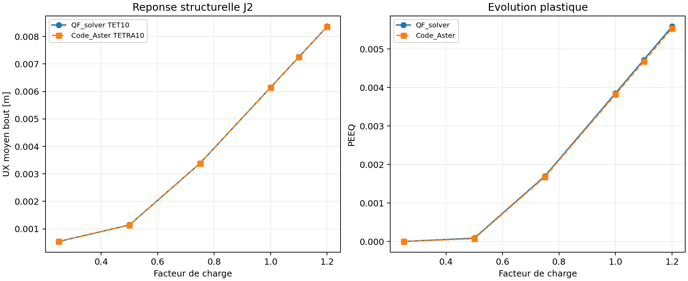
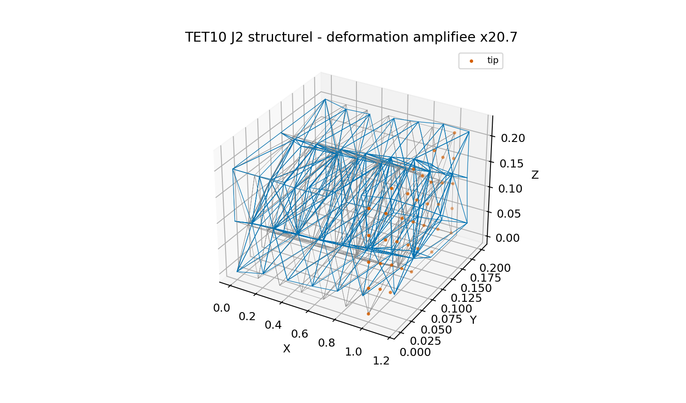

# Benchmark externe structurel TET10 J2

Cette campagne compare QF_solver TET10 avec Code_Aster TETRA10 et la relation
`VMIS_ISOT_LINE`. Le cas est structurel : les deux solveurs resolvent le meme
maillage tridimensionnel, le meme encastrement, les memes forces nodales
reparties et les memes facteurs de charge.

Le resultat est une preuve externe de developpement. Il ne constitue pas encore
une Owner review ni une qualification generale de la plasticite TET10.

## Modele

La piece est une barre homogene de longueur `1,0 m` et de section carree
`0,2 m x 0,2 m`. Le maillage commun contient `341 noeuds` et `140 elements`
TET10/TETRA10. La face `x=0` est encastree sur `UX`, `UY` et `UZ`. Une force
axiale totale de `18 MN` est repartie sur la face `x=1,0 m`.

Le materiau est isotrope J2 avec ecrouissage isotrope lineaire :
`E=210 GPa`, `nu=0,30`, limite `250 MPa` et module d'ecrouissage
`50 GPa`. Le chargement monotone utilise les facteurs `0,25`, `0,50`, `0,75`,
`1,00`, `1,10` et `1,20`.

## Resultats

| Facteur | UX QF_solver [m] | UX Code_Aster [m] | PEEQ QF_solver | PEEQ Code_Aster |
| ---: | ---: | ---: | ---: | ---: |
| 0,25 | 5,409307e-04 | 5,409307e-04 | 0,000000e+00 | 0,000000e+00 |
| 0,50 | 1,141104e-03 | 1,139656e-03 | 8,620856e-05 | 7,247894e-05 |
| 0,75 | 3,386758e-03 | 3,385724e-03 | 1,697543e-03 | 1,678893e-03 |
| 1,00 | 6,149636e-03 | 6,147667e-03 | 3,850652e-03 | 3,817083e-03 |
| 1,10 | 7,255844e-03 | 7,253455e-03 | 4,715847e-03 | 4,675120e-03 |
| 1,20 | 8,362248e-03 | 8,359594e-03 | 5,581952e-03 | 5,534470e-03 |





## Controles

| Controle | Valeur | Limite | Statut |
| --- | ---: | ---: | --- |
| RMS chemin UX | 0,02173 % | 10 % | PASS |
| Ecart UX final | 0,03175 % | 5 % | PASS |
| RMS chemin PEEQ moyen integration | 0,55084 % | 10 % | PASS |
| Residu relatif maximal QF_solver | 7,40079e-11 | 1e-7 | PASS |

La PEEQ est comparee comme moyenne des points d'integration dans les deux
solveurs. Le maximum QF_solver est conserve dans `summary.json` comme
information complementaire, mais n'est pas compare a une moyenne Code_Aster.

## Interpretation

L'accord structurel des deplacements est tres bon sur toute la branche de
chargement. L'accord de la PEEQ moyenne est egalement satisfaisant, avec une
erreur RMS de `0,55084 %`. Cette campagne soutient le comportement TET10 J2
en petits deformations sur une barre homogene et un chargement axial monotone.

Elle ne permet pas encore de conclure pour les inversions cycliques, les
grandes deformations, le flambement, le contact, le dommage, la rupture ou les
structures complexes. Les contraintes ponctuelles proches des singularites
restent informatives uniquement.

## Reproductibilite

```powershell
python .\scripts\run_code_aster_tet10_j2_structural_vnv.py `
  --output .\results\VNV-TET10-J2-CODEASTER-STRUCTURAL-025
```

Le dossier de resultats contient `model.json`, `results.json`, `summary.json`,
`report.md`, `deformation.vtu`, les decks Code_Aster et les figures. La copie de
reference est dans
`qualification/vnv/external/code_aster_tet10_j2_structural/reference/`.

## Revue Owner a prevoir

La revue devra statuer sur l'acceptabilite du cas comme preuve externe TET10
J2, tout en conservant la maturite `experimental`. Elle devra aussi demander,
avant une maturite superieure, un cas de geometrie plus complexe et un cas avec
chargement non monotone.
