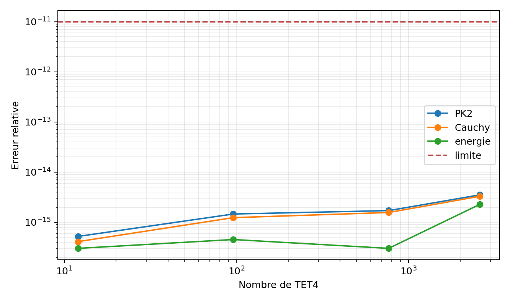
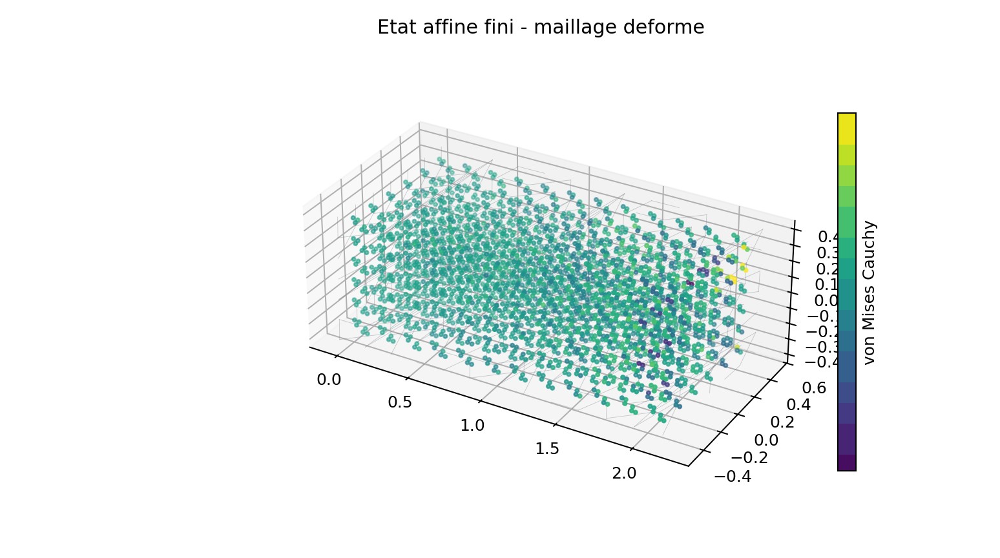
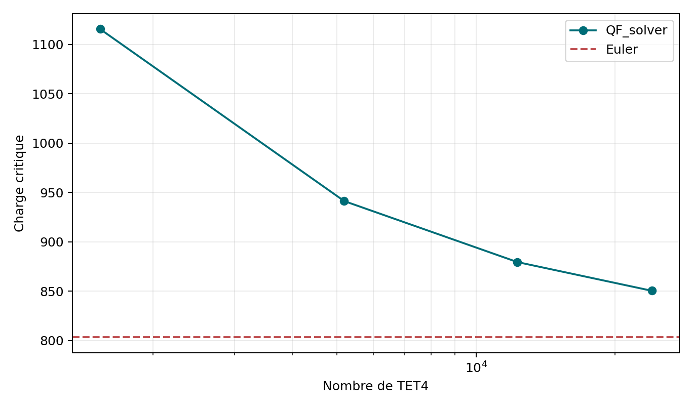
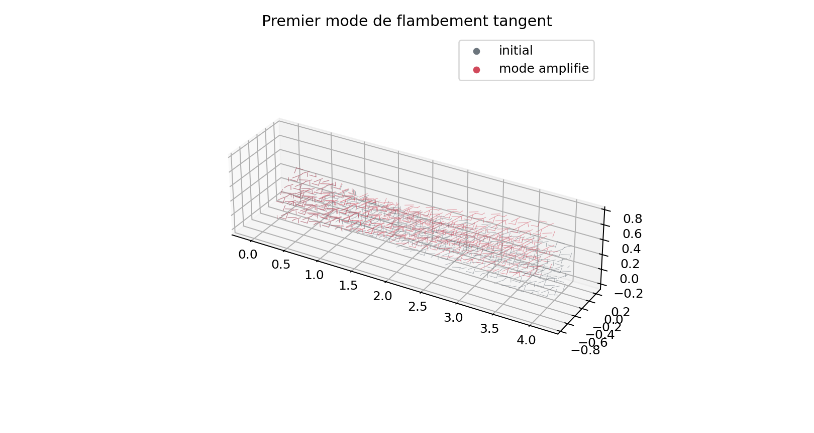
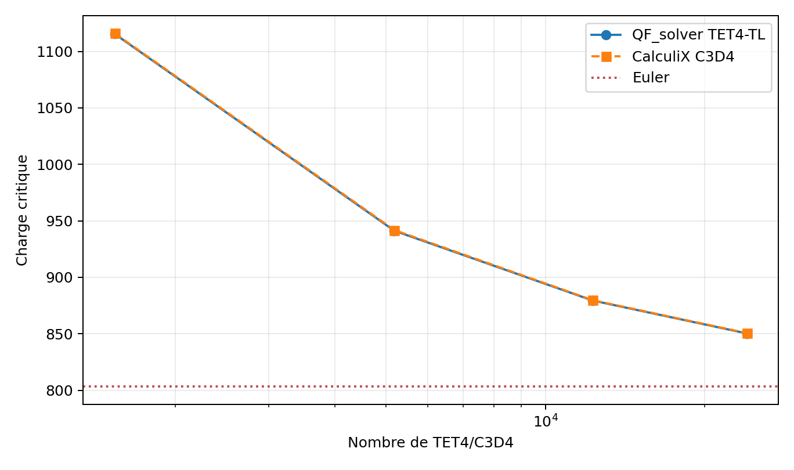
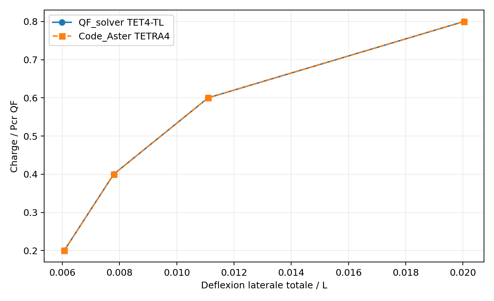
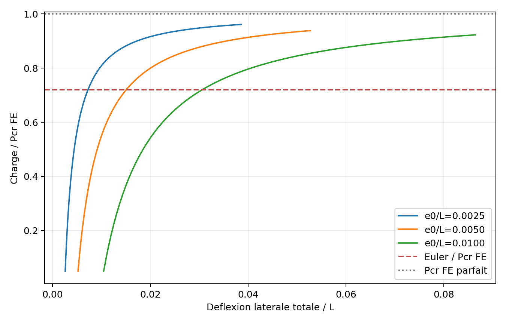
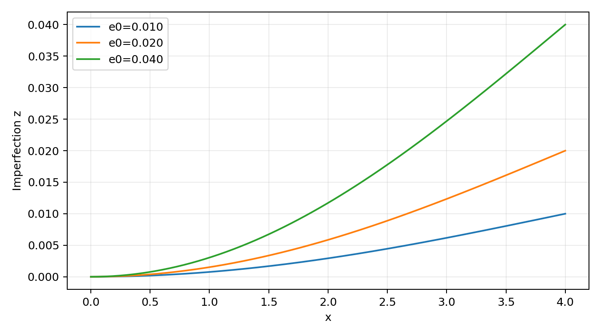
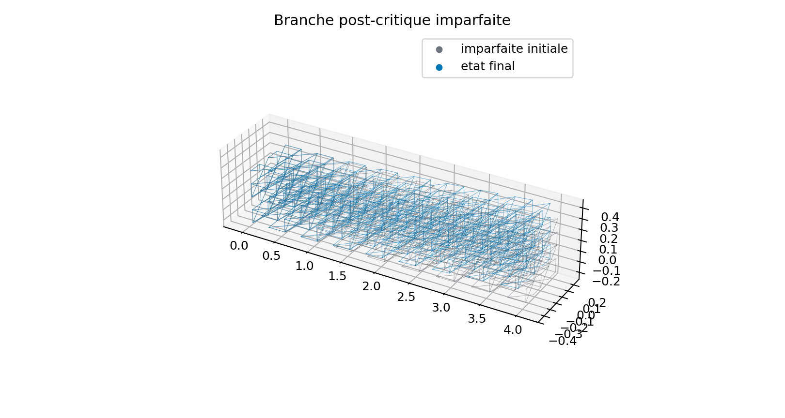

# TET4 total lagrangien - campagne structurelle V2

Cette page rassemble les preuves produites apres la revue V1 du noyau
total-lagrangien. Les cinq campagnes internes et externes passent leurs criteres
automatises, mais elles restent au statut **research / candidate for mechanical review**. Elles ne
modifient pas automatiquement la decision Owner du perimetre V1. La revue V2
du 18 juillet 2026 les accepte maintenant avec recommandations pour l'usage
engineering interne.

## Perimetre

| Etude | Objet | Reference | Verdict automatise |
| --- | --- | --- | --- |
| `VNV-TET4-TL-STRESS-005` | Green-Lagrange, PK2, Cauchy et energie | champ affine fini analytique | `PASS_STRESS_ENERGY` |
| `VNV-TET4-TL-BUCKLING-EULER-006` | perte de positivite de la tangente | charge critique d'Euler | `PASS_BUCKLING_RESEARCH` |
| `VNV-TET4-TL-POSTBUCKLING-007` | branches de colonnes imparfaites | Pcr Euler et Pcr FE du meme maillage | `PASS_POSTBUCKLING_RESEARCH` |
| `VNV-TET4-TL-CALCULIX-STRUCTURAL-008` | contrainte finie et flambement propre | CalculiX 2.20 C3D4, meme connectivite | `PASS_EXTERNAL_CORRELATION` |
| `VNV-TET4-TL-CODEASTER-STRUCTURAL-009` | PK2 et branche imparfaite | Code_Aster 18.1.0 TETRA4, meme connectivite | `PASS_EXTERNAL_CORRELATION` |
| `VNV-TET4-TL-BUCKLING-H5-010` | raffinement proche de 100k TET4 | Euler et CalculiX 2.20 C3D4 | `PASS_REFINEMENT_ACCEPTANCE` |

Les charges sont des charges mortes nodales. La loi reste
Saint-Venant-Kirchhoff. Le contact, la pression suiveuse, la plasticite en
deformation finie et les imperfections aleatoires restent hors perimetre.

## Contraintes finies

Le gradient de deformation et la deformation de Green-Lagrange sont :

\[
\mathbf F = \mathbf I + \nabla_{X}\mathbf u,
\qquad
\mathbf E = \frac{1}{2}\left(\mathbf F^T\mathbf F-\mathbf I\right).
\]

La loi de verification donne la contrainte de Piola-Kirchhoff 2 :

\[
\mathbf S = \lambda\,\operatorname{tr}(\mathbf E)\mathbf I+2\mu\mathbf E.
\]

La contrainte vraie dans la configuration courante est obtenue par
push-forward :

\[
\boldsymbol\sigma = \frac{1}{J}\mathbf F\mathbf S\mathbf F^T,
\qquad J=\det(\mathbf F)>0.
\]

Le patch affine est reproduit sur `12`, `96`, `768` et `2592` TET4. L'erreur
maximale combine Green-Lagrange, PK2, Cauchy, energie et determinant. Elle doit
rester inferieure a `1e-11`.





Cette preuve est volontairement sans singularite. Elle valide la transformation
des contraintes et l'energie, pas une extrapolation au pied d'un encastrement.

## Flambement lineaire

La reference encastree-libre est :

\[
P_{cr}^{Euler}=\frac{\pi^2 E I}{4L^2}=803.190462.
\]

Un etat precontraint faible, egal a `5 %` de la charge d'Euler, est d'abord
resolu. La variation de tangente par unite de charge fournit la raideur
geometrique linearisee. La charge critique est ensuite la premiere valeur de
`P` telle que :

\[
\left(\mathbf K_0+P\mathbf K_G\right)\boldsymbol\phi=\mathbf 0.
\]

| TET4 | DDL | Pcr QF_solver | Ecart Euler | Variation |
| ---: | ---: | ---: | ---: | ---: |
| 1 536 | 1 275 | 1 115.47 | 38.88 % | - |
| 5 184 | 3 675 | 941.21 | 17.18 % | 15.62 % |
| 12 288 | 8 019 | 879.41 | 9.49 % | 6.57 % |
| 24 000 | 14 883 | 850.34 | 5.87 % | 3.31 % |

La tendance converge vers Euler. La surestimation est coherente avec la raideur
en flexion d'un tetraedre lineaire; elle justifie le raffinement important et le
maintien au statut recherche.

Le point supplementaire `64x16x16` contient `98 304` TET4 et `56 355` DDL. Sa
charge critique vaut `818.415402`, soit une erreur Euler de `1.896 %`. CalculiX
donne `818.696000` sur la meme connectivite, soit `0.0343 %` d'ecart.






## Correlation CalculiX C3D4

CalculiX utilise exactement les memes noeuds, tetraedres, blocages et charges.
Le patch fini compare directement les six composantes de Cauchy. Le flambement
emploie la charge nodale unitaire de l'etape `*BUCKLE`; le facteur propre est
donc la charge critique.

| C3D4/TET4 | Pcr QF_solver | Pcr CalculiX | Ecart QF/CalculiX | Ecart CalculiX/Euler |
| ---: | ---: | ---: | ---: | ---: |
| 1 536 | 1 115.471 | 1 115.981 | 0.046 % | 38.944 % |
| 5 184 | 941.210 | 941.805 | 0.063 % | 17.258 % |
| 12 288 | 879.405 | 879.721 | 0.036 % | 9.528 % |
| 24 000 | 850.340 | 850.640 | 0.035 % | 5.908 % |

L'erreur relative du tenseur de Cauchy vaut `1.17e-7`. L'accord entre les deux
implementations montre que la surestimation grossiere de la charge d'Euler est
une erreur de discretisation en flexion commune au tetraedre lineaire, pas une
divergence de l'algorithme QF_solver.



## Correlation Code_Aster TETRA4

Code_Aster est utilise dans son domaine `GREEN_LAGRANGE + ELAS`, c'est-a-dire
grands deplacements et petites deformations. Sur le patch affine, l'ecart du
second tenseur de Piola-Kirchhoff est `8.54e-5` relatif.

La colonne imparfaite `16x4x4`, avec `e0/L=0.005`, est ensuite chargee par force
morte jusqu'a `0.8 Pcr` sur quatre niveaux identiques. L'ecart maximal de
deflexion laterale totale QF_solver/Code_Aster vaut `1.69e-9` relatif.




L'operateur de flambement lineaire `RIGI_GEOM` de Code_Aster n'est pas documente
pour la meme modelisation solide `3D/TETRA4`. Aucun resultat poutre ou coque
different n'est donc presente comme une correlation solide. CalculiX couvre le
probleme propre; Code_Aster couvre la branche non lineaire imparfaite.

## Suivi post-critique

La geometrie imparfaite, initialement sans contrainte, suit le premier mode
classique de l'encastrement-libre :

\[
z_0(x)=e_0\left[1-\cos\left(\frac{\pi x}{2L}\right)\right].
\]

La continuation impose la contrainte spherique :

\[
\Delta\mathbf u^T\Delta\mathbf u
+\psi^2\Delta\lambda^2=\Delta s^2.
\]

La correction est construite avec deux resolutions creuses de la tangente, une
pour le residu et une pour le vecteur de charge. Aucune matrice augmentee dense
n'est formee.

| e0/L | Etapes | Pmax/Pcr FE | Pmax/P Euler | Amplification finale | Residu max |
| ---: | ---: | ---: | ---: | ---: | ---: |
| 0.0025 | 120 | 0.9613 | 1.3350 | 15.43 | 9.53e-9 |
| 0.0050 | 120 | 0.9385 | 1.3034 | 10.55 | 8.85e-9 |
| 0.0100 | 120 | 0.9228 | 1.2816 | 8.65 | 8.58e-9 |

Le minimum global de `det(F)` vaut `0.9832`. Les trois chemins sont continus et
depassent `1.28` fois la charge d'Euler tout en restant sous la bifurcation du
maillage parfait, ce qui est attendu pour une structure imparfaite.







## Reproduction

```powershell
python .\scripts\run_tet4_tl_stress_vnv.py
python .\scripts\run_tet4_tl_buckling_vnv.py
python .\scripts\run_tet4_tl_postbuckling_vnv.py
python .\scripts\run_calculix_tl_structural_vnv.py --output .\results\VNV-TET4-TL-CALCULIX-STRUCTURAL-008
python .\scripts\run_code_aster_tl_structural_vnv.py --output .\results\VNV-TET4-TL-CODEASTER-STRUCTURAL-009
python .\scripts\run_tet4_tl_buckling_refinement.py
python .\qf_solver.py solve --input .\examples\tet4_geometric_nonlinear_static.json --output .\results\tet4_geometric_nonlinear_static.json
```

Chaque repertoire `results/VNV-*` contient `summary.json`, `report.md`, les PNG
et `vnv_manifest.json`. Le post-flambement enregistre aussi l'empreinte SHA-256
du resultat de flambement dont il utilise la charge critique.

## Decision mecanique

Quentin Farinazzo accepte le 18 juillet 2026 le push-forward Cauchy, les trois
amplitudes d'imperfection, la continuation arc-length, les correlations externes
et la charge critique apres confirmation a `98 304` TET4. Decision :
**accepted_with_recommendations**, en auto-revue non independante.

La grille detaillee est disponible dans
[la revue mecanique structurelle V2](revue_tet4_total_lagrangian_structural_v2.md).
