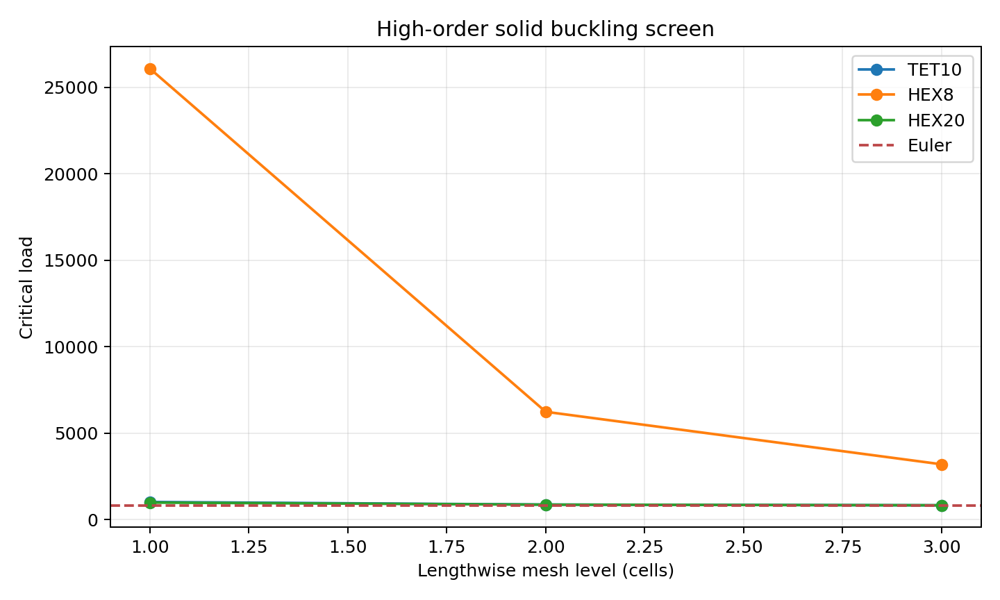
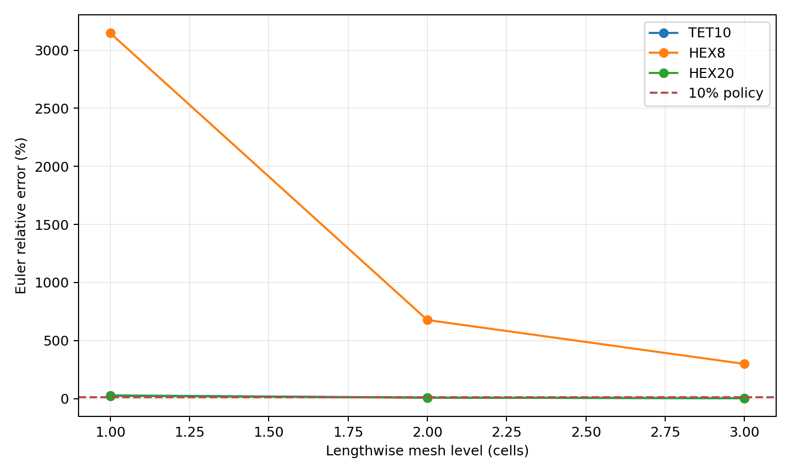

# G08 High-order analytical Euler evidence

Status: **PARTIAL_ANALYTICAL_SCREEN**. Official G08 status remains **PASS_WITH_LIMITATIONS**.

Execution source SHA: `4c45b46cfa7c9a664986bb49a53ef25fa570c030`; dirty: `False`.

## Declared benchmark

The benchmark is a homogeneous isotropic fixed-free solid column with a conservative axial nodal dead load distributed over the loaded end face. Euler is used as an independent screening oracle under the declared slender-column assumptions; this is not a general 3D-solid validation oracle.

- `Pcr = pi^2 E I / (4 L^2)`; `E=1e+06`, `nu=0.3`, `L=4`, `b=0.5`, `h=0.5`, `I=0.00520833333333`.
- Euler reference: `803.190462328`; declared error tolerance: `10%`.
- Fixed-free conditions: all translations fixed at `x=0`; compressive `UX` load distributed over all nodes at `x=L`.
- Axial mesh rows change only the lengthwise partition and retain one solid layer through each transverse direction.

## Results

| Family | Axial cells | Transverse cells | Loaded nodes | Nodal force | Total force | Lambda | Pcr QF | Euler error | Eigen residual | Mode |
|---|---:|---:|---:|---:|---:|---:|---:|---:|---:|---|
| TET10 | 1 | 1 | 9 | -0.111111 | -1 | 1022.2874 | 1022.2874 | 27.278% | 9.902e-12 | GLOBAL_BENDING_CANDIDATE |
| TET10 | 2 | 1 | 9 | -0.111111 | -1 | 871.17976 | 871.17976 | 8.465% | 8.392e-12 | GLOBAL_BENDING_CANDIDATE |
| TET10 | 3 | 1 | 9 | -0.111111 | -1 | 829.44982 | 829.44982 | 3.269% | 9.012e-12 | GLOBAL_BENDING_CANDIDATE |
| HEX8 | 1 | 1 | 4 | -0.25 | -1 | 26084.67 | 26084.67 | 3147.632% | 2.392e-08 | GLOBAL_BENDING_CANDIDATE |
| HEX8 | 2 | 1 | 4 | -0.25 | -1 | 6236.7816 | 6236.7816 | 676.501% | 2.812e-13 | GLOBAL_BENDING_CANDIDATE |
| HEX8 | 3 | 1 | 4 | -0.25 | -1 | 3200.0167 | 3200.0167 | 298.413% | 7.679e-13 | GLOBAL_BENDING_CANDIDATE |
| HEX20 | 1 | 1 | 8 | -0.125 | -1 | 987.57071 | 987.57071 | 22.956% | 1.099e-11 | GLOBAL_BENDING_CANDIDATE |
| HEX20 | 2 | 1 | 8 | -0.125 | -1 | 868.02585 | 868.02585 | 8.072% | 7.550e-12 | GLOBAL_BENDING_CANDIDATE |
| HEX20 | 3 | 1 | 8 | -0.125 | -1 | 832.27868 | 832.27868 | 3.622% | 7.264e-12 | GLOBAL_BENDING_CANDIDATE |

## Interpretation

The Euler screen is evaluated independently for each family and level. A failed Euler screen is retained as a diagnostic result and is not repaired by changing the solver, eigensolver, mesh policy or tolerance. Mode norms and residuals are route checks; they do not establish physical mode-shape agreement by themselves.

No family is promoted automatically by this study. The result must be read together with the existing G08 mesh, external-correlation and first-mode evidence.

## Transverse mesh diagnostic

The supplementary transverse screen keeps two axial cells and uses one, two and three layers in each transverse direction. It is reported separately from the axial refinement and does not change the official G08 mesh policy.

| Family | Axial cells | Transverse cells | Loaded nodes | Total force | Pcr QF | Euler error | Mode |
|---|---:|---:|---:|---:|---:|---:|---|
| TET10 | 2 | 1 | 9 | -1 | 871.17976 | 8.465% | GLOBAL_BENDING_CANDIDATE |
| TET10 | 2 | 2 | 25 | -1 | 866.29775 | 7.857% | GLOBAL_BENDING_CANDIDATE |
| TET10 | 2 | 3 | 49 | -1 | 865.11116 | 7.709% | GLOBAL_BENDING_CANDIDATE |
| HEX8 | 2 | 1 | 4 | -1 | 6236.7816 | 676.501% | GLOBAL_BENDING_CANDIDATE |
| HEX8 | 2 | 2 | 9 | -1 | 6177.3542 | 669.102% | GLOBAL_BENDING_CANDIDATE |
| HEX8 | 2 | 3 | 16 | -1 | 6165.3555 | 667.608% | GLOBAL_BENDING_CANDIDATE |
| HEX20 | 2 | 1 | 8 | -1 | 868.02585 | 8.072% | GLOBAL_BENDING_CANDIDATE |
| HEX20 | 2 | 2 | 21 | -1 | 848.8194 | 5.681% | GLOBAL_BENDING_CANDIDATE |
| HEX20 | 2 | 3 | 40 | -1 | 844.65279 | 5.162% | GLOBAL_BENDING_CANDIDATE |
