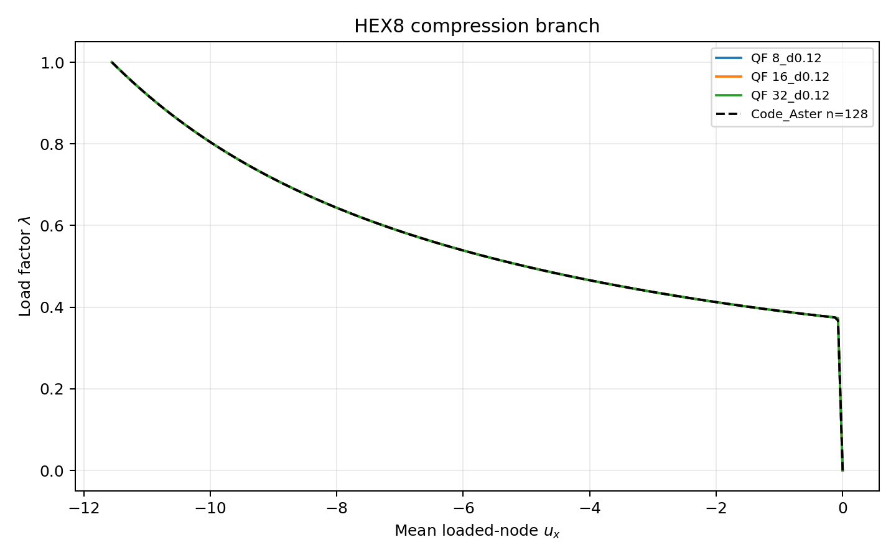
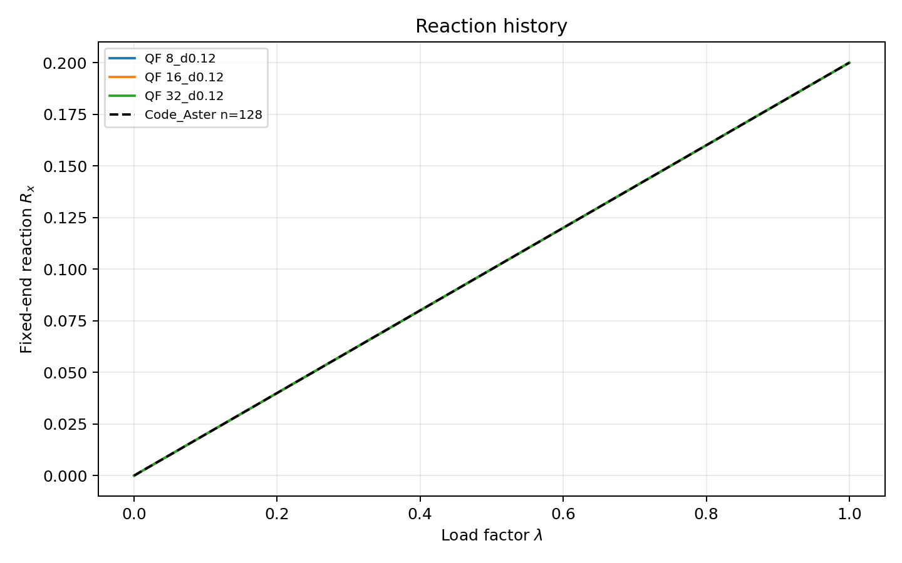
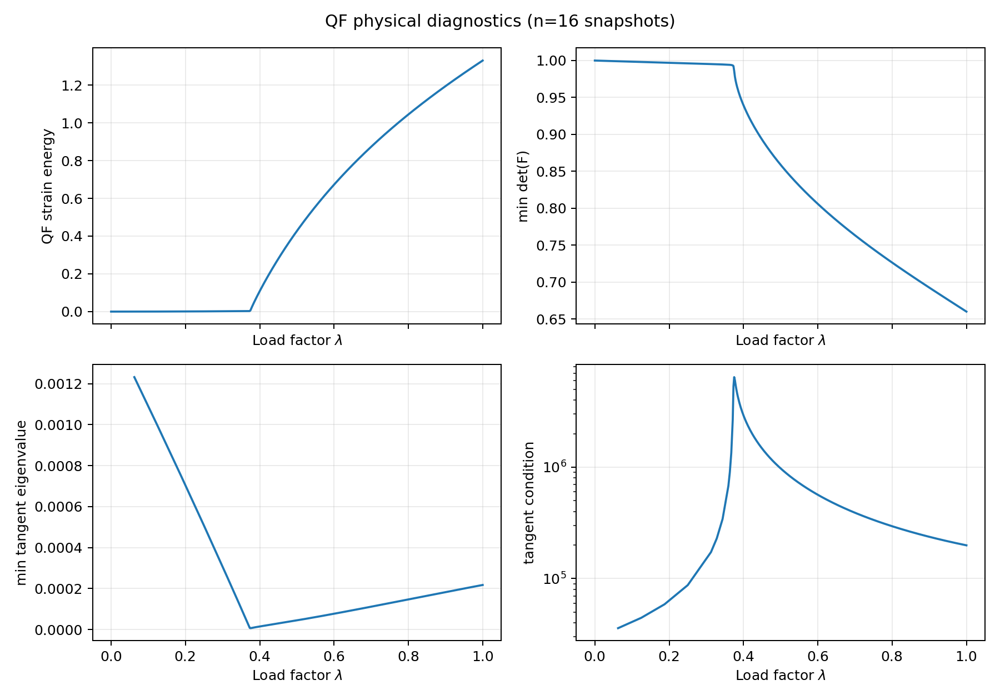
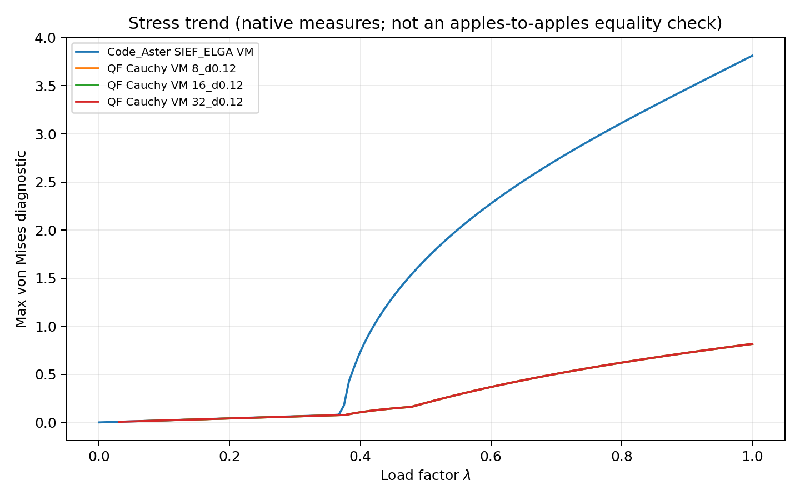

# TL Physical Branch Validation

Status: **DIAGNOSTIC_ONLY**. This report tests whether the recovered HEX8 states are on a physically consistent branch; it does not promote Total-Lagrangian capability or change solver policy.

## Provenance

- Numerical solver source: `cb3f420696d7e23c059b017e1a4b7a43f310effb`.
- QF capture harness: `06aedde24f9695f389a8d671d0a5c8f86db06d42`; run worktree clean.
- Code_Aster deck harness: `3a8fc7067762bf7f5e96dec3e3866dd28749da82`; pinned image `simvia/code_aster@sha256:4629a21a109309bb97fbdc27d750445cc869e151e2e2ed6290f69539614e4435`.
- Code_Aster input digests: `{"physical_branch.comm": "ff3bbb468d12d78be09cafe0789f627da94251fe8f9bddeaffb9718ef8abe863", "physical_branch.mail": "4724571c50c66c6d78b097448a62275d7e546e4ce0a9b013a04ebc89befdcbfe"}`.
- The numerical source was not modified; harness commits are diagnostic infrastructure only.

## Model equivalence

The QF and Code_Aster runs use the same 20-node/4-element HEX8 mesh, including the aspect-10 x scaling and 0.12 x-distortion, E=10, nu=0.3, all translational DOFs fixed at x=0, and -0.2 total FX distributed as -0.05 on each of the four x=10 nodes. Both use a dead-load ramp and Green-Lagrange finite-kinematic elasticity.

## Branch result

- QF n=8: `status=SUCCESS, accepted=20516, rejected=4, snapshots=332, final_ux=-11.555045657, final_reaction_x=0.2, final_det_f_min=0.659932665186, final_energy=1.32987337365, final_fd_tangent=1.68532763543e-08`.
- QF n=16: `status=SUCCESS, accepted=10267, rejected=3, snapshots=333, final_ux=-11.555045657, final_reaction_x=0.2, final_det_f_min=0.659932665186, final_energy=1.32987337365, final_fd_tangent=2.63250015457e-08`.
- QF n=32: `status=SUCCESS, accepted=20522, rejected=3, snapshots=338, final_ux=-11.555045657, final_reaction_x=0.2, final_det_f_min=0.659932665186, final_energy=1.32987337365, final_fd_tangent=1.88826480183e-08`.
- Code_Aster: `status=OBSERVED_EXTERNAL_PATH, rows=128, final_ux=-11.555045657, final_reaction_x=0.2`.
- All QF and Code_Aster load-factor histories are monotone; QF turning candidates: `{'HEX8_m4_a10_compression_l0.2_n8_d0.12': 0, 'HEX8_m4_a10_compression_l0.2_n16_d0.12': 0, 'HEX8_m4_a10_compression_l0.2_n32_d0.12': 0}`, Code_Aster: `0`.
- QF minimum tangent eigenvalue over sampled accepted states: `6.892484e-06`; maximum condition diagnostic: `6.437182e+06`.

## Complete-curve comparisons

The comparisons below interpolate the QF accepted-state snapshots onto Code_Aster's 128 uniform load points. QF physical snapshots are sampled at load-factor bins while the complete adaptive acceptance history, residual history and cutback events remain in the ignored raw artifacts.

| QF partition | max abs u error | normalized u error | max abs reaction error | normalized reaction error |
| --- | ---: | ---: | ---: | ---: |
| 8_d0.12 | 2.326085e-05 | 2.013047e-06 | 3.680181e-12 | 1.840091e-11 |
| 16_d0.12 | 8.675600e-06 | 7.508062e-07 | 1.288037e-10 | 6.440185e-10 |
| 32_d0.12 | 3.598910e-06 | 3.114578e-07 | 7.531644e-11 | 3.765822e-10 |

The three QF partitions converge to the same final scalar state within the captured precision and have the same branch shape. The external displacement and reaction histories agree closely with QF in this matched model; the reported interpolation errors include the deliberate physical-snapshot sampling step.

## What is and is not compared

- **Load-displacement:** comparable and matched over the full sampled path.
- **Reactions:** the fixed-end x resultant is comparable and matched; the QF fixed-DOF norm also contains self-equilibrating transverse components and is not used as the scalar correlation.
- **Stress:** both histories are archived. Code_Aster `SIEF_ELGA` and QF Cauchy stress were not converted to a proven common measure at every point, so the stress plot is a trend diagnostic, not a PASS equality claim.
- **Energy:** QF strain energy and Code_Aster current-load work are different quantities; energy agreement is therefore **NOT ESTABLISHED** by this run.
- **det(F):** QF reports `det(F)`; the external deck did not expose an equivalent field, so external det(F) agreement is **NOT ESTABLISHED**. QF remains positive over the tested path (`min det(F)≈0.65993`).
- **Tangent eigenvalues/residuals:** these are QF diagnostics. Code_Aster logs converged every one of its 128 increments, but no directly comparable global tangent spectrum was exported.

## Classification

`PHYSICAL_BRANCH_CONFIRMED = YES` within this bounded diagnostic domain: an independent Code_Aster `STAT_NON_LINE` run using the same mesh, loads, boundary conditions, material and Green-Lagrange elastic formulation follows the same monotone QF branch through λ=1, with close full-curve displacement/reaction agreement and final-state differences at about 1e-12. This does not establish universal TL robustness, behavior beyond det(F)>0, or qualification of the adaptive rescue policy.

`ROOT_CAUSE_FINAL_INTERPRETATION = LOAD_CONTROL_NEWTON_ROBUSTNESS_BOUNDARY`: the former fixed-step failures are consistent with a highly conditioned tangent near λ≈0.375; the adaptive path reaches the independently reproduced equilibrium state. No QF formulation defect was demonstrated.

`RESCUE_POLICY_PHYSICALLY_SUPPORTED = YES` for the three exact HEX8 paths tested, as a bounded diagnostic result only. The policy remains opt-in and is not promoted to a default or qualification rule.

`READY_FOR_RESCUE_OPTIMIZATION = YES` for a separate, controlled R&D task.
`READY_FOR_TL_PROMOTION_CAMPAIGN = NO` because this evidence covers one HEX8 compression domain and does not close the broader TL boundary, objectivity, mesh, failure-zoo or multi-family qualification scope.

No solver fix, threshold change, TL promotion, Arc-Length/G08 work, push, merge, tag, release or PyPI publication was performed.
