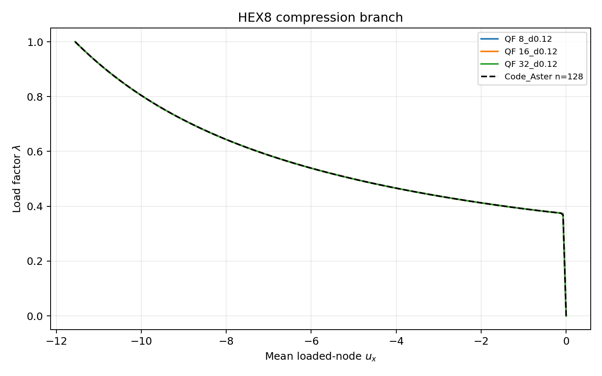
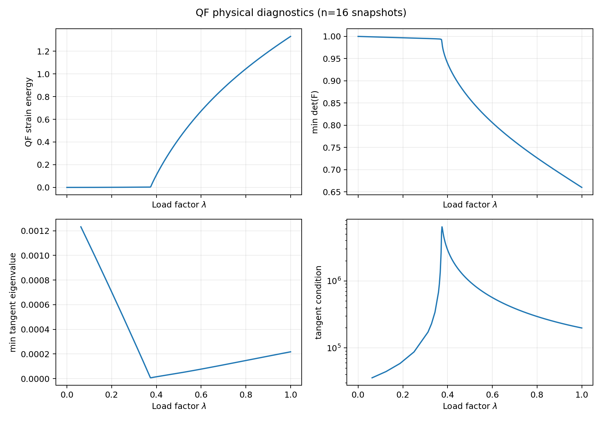
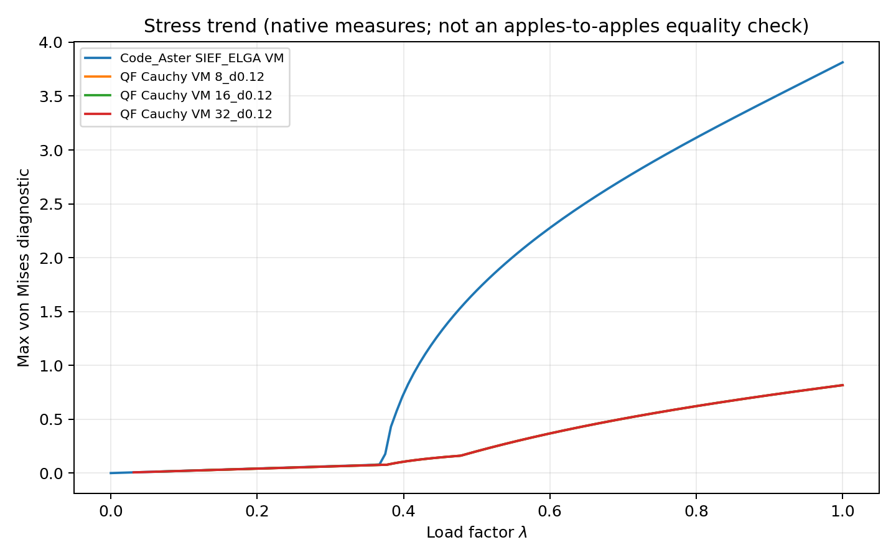

# TL Rescue Optimization Diagnostic

Status: **DIAGNOSTIC_ONLY**. The candidate is an opt-in adaptive-load policy. It does not change the default path, the Total-Lagrangian formulation, the tangent, the convergence tolerance, or the TL maturity claim.

## Scope and provenance

- Study: `TL-RESCUE-OPTIMIZATION-026`.
- Investigation start SHA: `fc3d92e26939616a4035061a21f1879197912b45`.
- Source SHA used for the final replay and targeted checks: `cebaa51177191f85a47df70b18fae388eae492a7`.
- `git diff fc3d92e..cebaa511 -- src/solveur` is empty: no functional solver source changed during this study.
- `formulation_changed=false`, `tangent_changed=false`, `default_path_changed=false` in every candidate run.
- The run summaries report `dirty_at_start=true` because the untracked report directory already existed. The dirty state contained diagnostic documentation only; no tracked numerical source was modified.
- The three-case screening JSON files used for cost selection were produced at source SHA `31e7b4899ac36b8a873b5c2376c4371fd0260a2f`.
- The saved candidate branch trajectories and plots were produced at source SHA `977da8f5c7ac4ec88d5b2ed38f6cf8de1a03503e`; no solver-source diff exists between that SHA and the final replay SHA.
- Clean baseline reference: `qualification/0_2_6/tl_final_rescue/full150_maxit200.json`, source SHA `4deb8eaacbc477141952a1042a1a36f3f7a8b1c5`.
- Code_Aster oracle: `simvia/code_aster@sha256:4629a21a109309bb97fbdc27d750445cc869e151e2e2ed6290f69539614e4435`.
- Code_Aster raw summary SHA-256: `c48b9e924023fbc267f139f3c20dcbae296d5ff1b57dfae496cf521f6880c220`.

Candidate controls:

`max_iterations=200, min_load_increment=1e-6, cutback_factor=0.25, max_cutbacks=64, growth_factor=1.02, grow_below_iterations=3, shrink_above_iterations=100, tolerance=1e-8`

Raw run artifact digests:

| Artifact | SHA-256 |
| --- | --- |
| `.tmp_tl_rescue_optimization/bounded_growth_1p02_full150.json` | `e285be255d65d2a37c4445a80022fb049bf31acf5a0356ac9db102c98115c0a5` |
| `.tmp_tl_rescue_optimization/bounded_growth_1p02_holdouts.json` | `9c3ecbf35562e7efee8db5549e054946f87714bba18729124183d59b31bfdad3` |
| `.tmp_tl_rescue_optimization/bounded_growth_1p02_failure_zoo.json` | `2a7fd49dea2d686b53086d8abf370358c85eb9f70e2bc73aa60ef5b3c59fbe8b` |
| `.tmp_tl_rescue_optimization/bounded_growth_1p02_repeat.json` | `17a7b5e7a72309bd8333008690fa82697d29a1f7665ad56d621cc489d93aeb3c` |

## Cost comparison on the externally matched target paths

| Increments | Baseline s | Candidate s | Speedup | Baseline assemblies | Candidate assemblies | Assembly reduction |
| ---: | ---: | ---: | ---: | ---: | ---: | ---: |
| 8 | 921.660 | 271.893 | 3.390x | 136784 | 57330 | 58.09% |
| 16 | 518.040 | 233.813 | 2.216x | 87562 | 53236 | 39.20% |
| 32 | 914.553 | 268.702 | 3.404x | 134341 | 54887 | 59.14% |

Cumulative observed cost: baseline `2354.253 s` and `358687` assemblies; candidate `774.408 s` and `165453` assemblies. Observed speedup is `3.040x`; assembly reduction is `53.87%`. These are local diagnostic measurements, not a universal performance guarantee.

## Full replay and robustness coverage

| Campaign | Cases | Successes | Failures | Assemblies | Newton iterations | Rejected increments |
| --- | ---: | ---: | ---: | ---: | ---: | ---: |
| Full corpus | 150 | 150 | 0 | 481251 | 105524 | 36 |
| Holdouts | 10 | 10 | 0 | 55171 | 10879 | 6 |
| Failure zoo replay | 4 | 4 | 0 | 200486 | 47797 | 13 |
| Deterministic repeat | 1 | 1 | 0 | 53236 | 11943 | 3 |

The full corpus covers the existing 150-case TET4/HEX8 TL rescue corpus. The holdouts include coarse-to-refined, bending, traction and compression cases. The failure zoo replayed the historical high-aspect-ratio compression cases, including `HEX8_m4_a7_compression_l0.2_n16_d0.12` and the `a10` cases with 8, 16 and 32 initial increments.

Every candidate final residual in the full corpus is at or below the existing `1e-8` convergence tolerance; the maximum is `6.117928574e-09`. The candidate used 36 rejected increments in the full corpus, so successful recovery did not erase fixed-step difficulty from the diagnostics.

## State and branch comparison

Across all 150 cases, candidate and clean-baseline statuses match. Maximum absolute differences for common final scalar state fields were:

| Field | Maximum absolute difference | Case |
| --- | ---: | --- |
| Displacement norm | `2.431139023e-08` | `HEX8_m4_a10_compression_l0.2_n16_d0.12` |
| Displacement maximum | `1.352899126e-08` | same |
| Reaction norm | `1.996375953e-09` | same |
| Strain energy | `3.028577167e-09` | same |
| Minimum `det(F)` | `5.481751719e-10` | same |
| Free residual norm | `1.876745057e-09` | same |

The differing displacement hashes are expected because the candidate accepts a different load-step partition. The exact physical scalar comparisons remain close to the clean baseline, and all candidate residuals satisfy the existing convergence tolerance. No new acceptance threshold is inferred from these comparisons.

The strict repeat of `HEX8_m4_a10_compression_l0.2_n16_d0.12` reproduced the same displacement hash `a08cebe10211d930bf57281221e6306f2bc9c0babbe324fc4b5b20ad7eed09d`, assembly count, accepted-step count, Newton count and rejection count. Determinism: **PASS** for the repeated case.

For the three externally matched HEX8 target paths, the candidate follows the same monotone physical branch as Code_Aster over the captured domain:

| Case | Normalized displacement difference | Normalized reaction difference | Turning candidates |
| --- | ---: | ---: | ---: |
| `n8` | `2.412792e-06` | `4.762746e-11` | 0 |
| `n16` | `2.254944e-06` | `6.440185e-10` | 0 |
| `n32` | `2.412792e-06` | `3.765822e-10` | 0 |

The external comparison is bounded to load-displacement and fixed-end x-reaction histories. External agreement for energy, `det(F)` and pointwise stress measures is **NOT_ESTABLISHED** because the exported Code_Aster observables are not proven equivalent.

The stress plot uses native solver measures and is explicitly diagnostic; it is not an apples-to-apples equality check.

## Policy decision

`bounded_growth_1p02` is retained as a promising opt-in robustness/performance candidate:

- 3/3 target rescue cases pass;
- full corpus: 150/150 pass;
- holdouts: 10/10 pass;
- failure zoo: 4/4 pass;
- deterministic repeat: pass;
- no formulation, tangent or default-path change;
- physical branch agreement is bounded and confirmed for the three matched Code_Aster paths.

The candidate is not a new qualification claim and does not broaden TL scope. The previous aggressive `adaptive_growth=1.5` policy remains rejected because its full replay changed physical states/branches.

`READY_FOR_TL_PROMOTION_CAMPAIGN = NO`. A separate Owner-controlled promotion campaign would still be required before any maturity decision or default-policy adoption.

No push, merge, tag, release or PyPI publication was performed.
