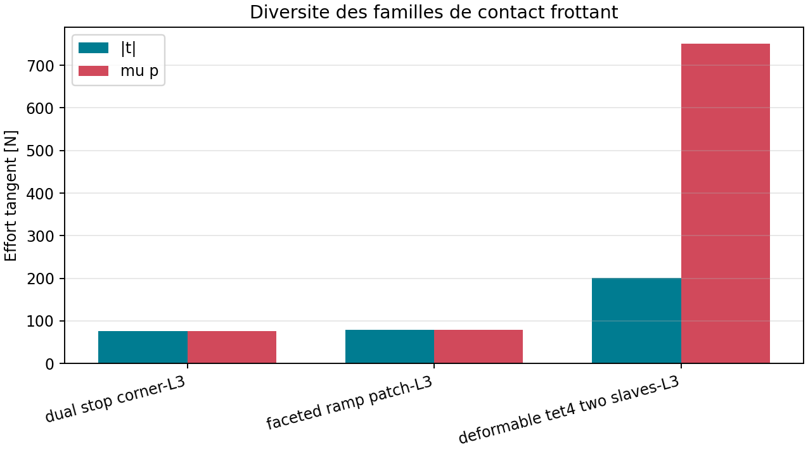

# VNV-CONTACT-FRICTION-FAMILIES-004

Statut interne : **PASS_INTERNAL**.

| Famille | Niveaux | Noeuds au niveau fin | Elements au niveau fin | Contacts | Etats | Gap max [m] | Cone max [N] |
| --- | ---: | ---: | ---: | ---: | --- | ---: | ---: |
| dual_stop_corner | 3 | 17 | 0 | 2 | slip | 0.000e+00 | 0.000e+00 |
| faceted_ramp_patch | 3 | 68 | 0 | 3 | slip | 2.776e-17 | 1.421e-14 |
| deformable_tet4_two_slaves | 3 | 732 | 3072 | 2 | stick | 9.159e-16 | -5.014e+02 |

Chaque famille comporte trois niveaux de maillage. Cette preuve interne ne ferme pas la decision Owner ni les limites surface-surface, grand glissement et dynamique.
